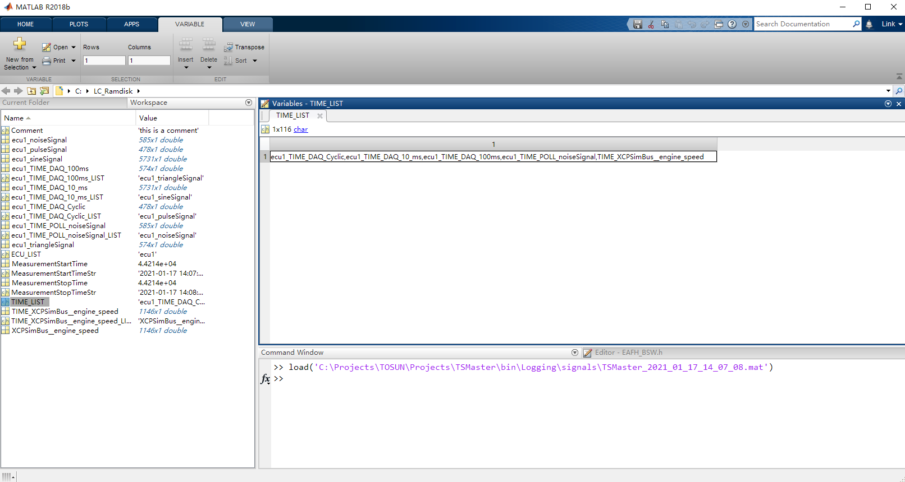
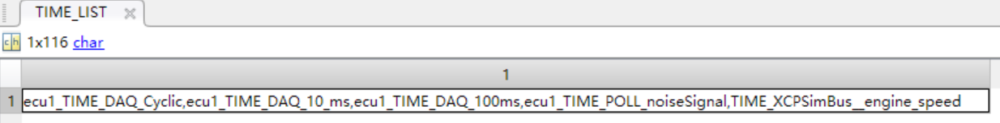
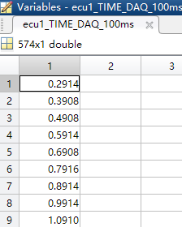
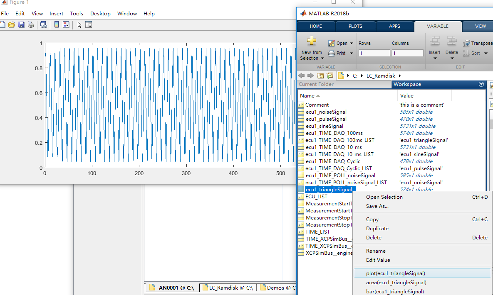
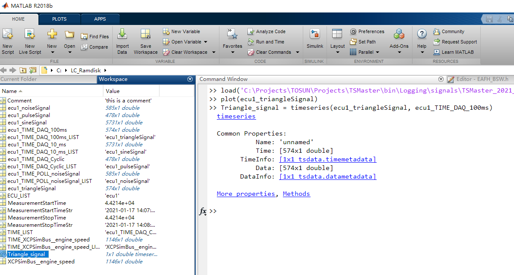
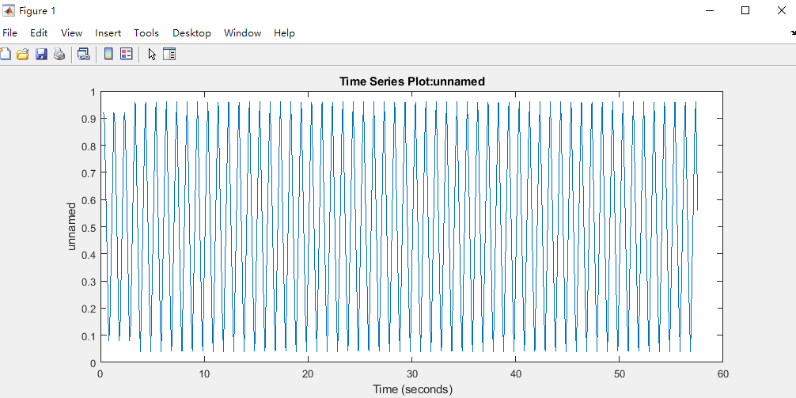
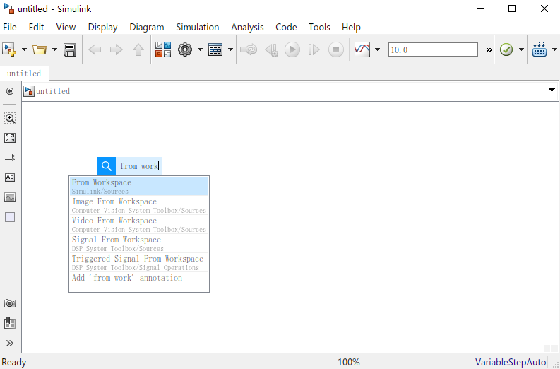
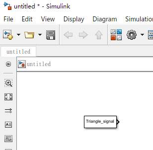
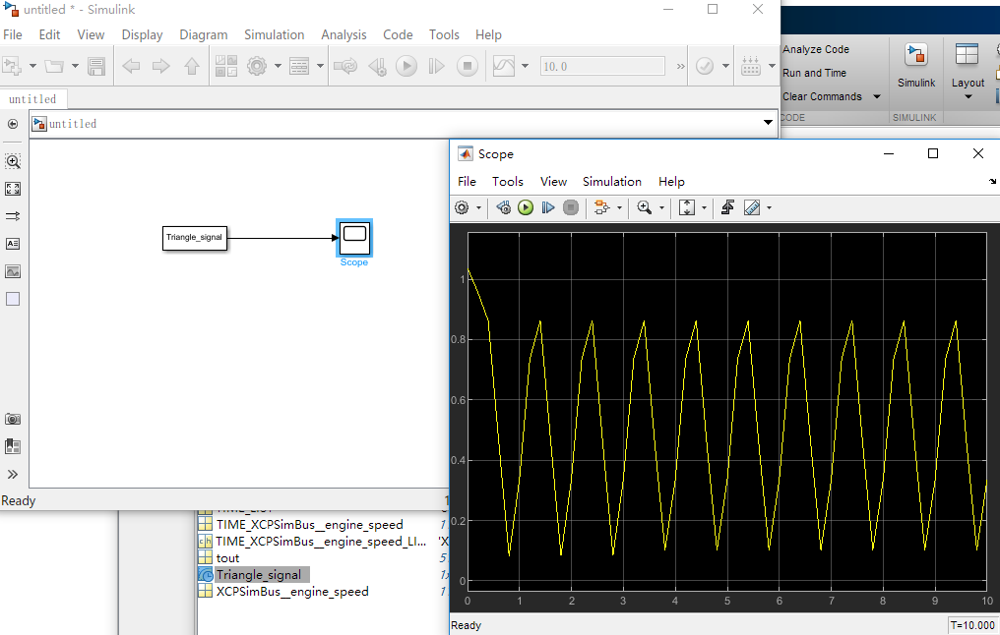

>   TSMaster 应用笔记

>   AN0003

>   TOSUN XCP controller mat log file format

>   同星XCP模块输出的mat文件格式说明

>   作者: Link

>   2021-01-17

目录

[TSMaster 应用笔记	1](#_Toc61816710)

[AN0003	1](#_Toc61816711)

[TOSUN XCP controller mat log file format	1](#_Toc61816712)

[同星XCP模块输出的mat文件格式说明	1](#_Toc61816713)

[作者: Link	1](#_Toc61816714)

[2021-01-17	1](#_Toc61816715)

[Chapter 1 mat变量格式定义	3](#_Toc61816716)

>   [1.1 固定变量定义	3](#_Toc61816717)

>   [1.2 时间解析方法	4](#_Toc61816718)

>   [1.3 时间关联的信号解析方法	5](#_Toc61816719)

>   [1.4 构建timeseries	6](#_Toc61816720)

[Chapter 2 Simulink信号回放	7](#_Toc61816721)

>   [2.1 模型中回放工作区变量	7](#_Toc61816722)

1.  mat变量格式定义

TSMasterXCP模块支持直接输出压缩的HDF5格式的mat文件（Matlab
7.3版本及以上），为基于Simulink的模型开发创造了便利。TSMaster
输出的mat文件载入Matlab后，其工作区变量列表如下：

图表 1 载入工作区的mat文件

1.  固定变量定义

固定变量列表如下：

| 序号 | 变量名称                | 含义                                                                                 |
|------|-------------------------|--------------------------------------------------------------------------------------|
| 1    | Comment                 | 注释信息，在同星标定模块的记录引擎配置中可以更改，若注释信息为空，则不会记录这个变量 |
| 2    | MeasurementStartTime    | 测量启动时间，TDateTime格式，double类型，用于自动化                                  |
| 3    | MeasurementStartTimeStr | 字符串表达的测量启动时间                                                             |
| 4    | MeasurementStopTime     | 测量结束时间，TDateTime格式，double类型，用于自动化                                  |
| 5    | MeasurementStopTimeStr  | 字符串表达的测量结束时间                                                             |
| 6    | ECU_LIST                | 参与标定的ECU列表，逗号分隔                                                          |
| 7    | TIME_LIST               | 时间列表，包含所有信号的时间信息                                                     |

1.  时间解析方法

首先分隔时间序列，获取所有时间轴：

图表 2 分隔时间序列

以AN0001中记录的信号为例，其时间序列TIME_LIST字符串变量如下：

ecu1_TIME_DAQ_Cyclic,ecu1_TIME_DAQ_10_ms,ecu1_TIME_DAQ_100ms,ecu1_TIME_POLL_noiseSignal,TIME_XCPSimBus__engine_speed

分隔后可根据名称在工作区取得每一根时间轴数组，每根时间轴数组可关联一个或一组信号，时间轴有三种类型，分别是DAQ时间（一根时间轴包含一个或一组信号）；Poll时间（一根时间轴对应一个信号）和系统变量时间（一根时间轴对应一个信号）：

| 序号 | 时间轴                       | 类型                         |
|------|------------------------------|------------------------------|
| 1    | ecu1_TIME_DAQ_Cyclic         | DAQ时间，对应Cyclic类型的DAQ |
| 2    | ecu1_TIME_DAQ_10_ms          | DAQ时间，对应10\_ms类型的DAQ |
| 3    | ecu1_TIME_DAQ_100ms          | DAQ时间，对应100ms类型的DAQ  |
| 4    | ecu1_TIME_POLL_noiseSignal   | Poll时间，对应查询类型的变量 |
| 5    | TIME_XCPSimBus__engine_speed | 系统变量时间，对应系统变量   |

根据每根时间轴数组名称可以提取时间轴的每个时刻绝对时间，单位时秒，以ecu1\_TIME_DAQ_100ms为例，如下图所示：

图表 3 时间轴数组

1.  时间关联的信号解析方法

获取了时间轴后，需要获取时间轴所关联的信号列表，并根据列表中信号名称定位信号。以时间轴ecu1\_TIME_DAQ_100ms为例，其对应的信号列表存放于名称
ecu1\_TIME_DAQ_100ms_LIST 的字符串变量里（逗号分隔），其变量名称规则为：

时间轴名称\_LIST

按逗号分隔方式展开字符串变量ecu1\_TIME_DAQ_100ms_LIST即可得到时间轴ecu1\_TIME_DAQ_100ms所对应的一个或一组变量名称，在本例中，只有一个名称：

ecu1_triangleSignal

这个变量名称最终定位到信号值数组“ecu1_triangleSignal”，该信号值数组的每一个元素与时间信号数组的每一个元素在时间上是一一对应的。

在这个信号上右击可以绘制信号按点分布的曲线（不带时间信息），如下图所示：

图表 4 信号上右键选择plot以绘制不带时间信息的值序列

1.  构建timeseries

若需要构建带时间信息的信号值序列，需要额外执行一段m脚本来构造timeseris，以信号ecu1_triangleSignal为例，其对应的时间轴是ecu1\_TIME_DAQ_100ms，则timeseries可以通过如下脚本构造：

Triangle_signal = timeseries(ecu1_triangleSignal, ecu1\_TIME_DAQ_100ms)

构造后，在工作区出现一个新的信号“Triangle_signal”：

图表 5 生成timeseries

右键绘制其变化曲线，可以看出横纵坐标分别是时间和值：

图表 6 绘制timeseries信号

1.  Simulink信号回放

    1.  模型中回放工作区变量

在模型中回放XCP信号有如下几个步骤：

打开Simulink模块，在模块空白处双击，选择“From Workspace”：

图表 7 双击空白处搜索“From Workspace”信号

根据timeseries的名称，将Simulink中的信号名称改为“Triangle_signal”，即可参与模型相关的算法仿真和测试过程：

图表 8 修改信号名称

连接Scope后，仿真结果如下：

图表 9 Simulink仿真结果
