# TSMaster User Manual

[Chapter 1 TSMaster User Interface](#tsmaster-user-interface)

> [1.1 User Interface Introduction](#_Toc64818761)

[1.1.1 Main Interface](#_Toc64818762)

[1.1.2 Ribbon Functions](#_Toc64818763)

[1.1.2.1 Analysis Tab](#_Toc64818764)

[1.1.2.2 Hardware Tab](#_Toc64818765)

[1.1.2.3 Project Tab](#_Toc64818766)

[1.1.2.4 Tools Tab](#_Toc64818767)

[1.1.3 Help Tab](#_Toc64818768)

[1.1.4 Application Shortcuts](#_Toc64818769)

[1.1.5 Univeral Drag and Drop](#_Toc64818770)

> [1.2 Channel Selection](#_Toc64818771)
>
> [1.3 System Messages Window](#_Toc64818772)
>
> [1.4 CAN / CAN FD Trace](#_Toc64818773)

[1.4.1 Trace toolbar](#_Toc64818774)

[1.4.2 Trace message identifier filter](#_Toc64818775)

[1.4.3 Trace list columns](#_Toc64818776)

[1.4.4 Trace Signals Display](#_Toc64818777)

[1.4.5 Popup Menus](#_Toc64818778)

> [1.5 CAN / CAN FD Transmit Window](#_Toc64818779)

[1.5.1 Transmit toolbar](#_Toc64818780)

[1.5.2 Transmit list](#_Toc64818781)

[1.5.3 Signals list](#_Toc64818782)

[1.5.3.1 Signal Name](#_Toc64818783)

[1.5.3.2 Signal Gen.](#_Toc64818784)

[1.5.3.3 Generator](#_Toc64818785)

[1.5.3.4 Raw Value](#_Toc64818786)

[1.5.3.5 Raw Step](#_Toc64818787)

[1.5.3.6 Physical Value](#_Toc64818788)

[1.5.3.7 Phys Step](#_Toc64818789)

[1.5.3.8 Comment](#_Toc64818790)

> [1.6 CAN Statistics](#_Toc64818791)

[1.6.1 CAN Statistics list](#_Toc64818792)

[1.6.2 CAN statistics popup menu](#_Toc64818793)

> [1.7 Graphics](#_Toc64818794)

[1.7.1 Graphics toolbar](#_Toc64818795)

[1.7.2 Graphics signal list](#_Toc64818796)

[1.7.3 Signal property inspector](#_Toc64818797)

[1.7.4 Signal Popup menu](#_Toc64818798)

> [1.8 CAN Database](#_Toc64818799)

[1.8.1 CAN database toolbar](#_Toc64818800)

[1.8.2 CAN database channel assignment](#_Toc64818801)

[1.8.3 CAN Database field viewer](#_Toc64818802)

[1.8.4 CAN element treeview](#_Toc64818803)

> [1.9 Hardware Configuration](#_Toc64818804)

[1.9.1 Configuration Page](#_Toc64818805)

[1.9.2 Channel configuration page](#_Toc64818806)

> [1.10 Bus Logging](#_Toc64818807)

[1.10.1 Bus logging toolbar](#_Toc64818808)

[1.10.2 Bus logging popup menu](#_Toc64818809)

> [1.11 Bus Playback](#_Toc64818810)

[1.11.1 Bus playback toolbar](#_Toc64818811)

[1.11.2 Bus playback popup menu](#_Toc64818812)

[1.11.3 Playback control](#_Toc64818813)

> [1.12 Meter](#_Toc64818814)

[1.12.1 Meter toolbar](#_Toc64818815)

[1.12.2 Meter Layout Control](#_Toc64818816)

[1.12.3 Meter signal editor](#_Toc64818817)

> [1.13 LIN Trace](#_Toc64818818)

[1.13.1 Trace toolbar](#_Toc64818819)

[1.13.2 Trace message identifier filter](#_Toc64818820)

[1.13.3 Trace list columns](#_Toc64818821)

[1.13.4 Trace Signals Display](#_Toc64818822)

[1.13.5 Popup Menus](#_Toc64818823)

> [1.14 LIN Transmit](#_Toc64818824)

[1.14.1 Transmit toolbar](#_Toc64818825)

[1.14.2 LIN schedule table list](#_Toc64818826)

[1.14.3 Transmit list](#_Toc64818827)

[1.14.4 Signals list](#_Toc64818828)

[1.14.4.1 Signal Name](#_Toc64818829)

[1.14.4.2 Signal Gen.](#_Toc64818830)

[1.14.4.3 Generator](#_Toc64818831)

[1.14.4.4 Raw Value](#_Toc64818832)

[1.14.4.5 Raw Step](#_Toc64818833)

[1.14.4.6 Physical Value](#_Toc64818834)

[1.14.4.7 Phys Step](#_Toc64818835)

[1.14.4.8 Comment](#_Toc64818836)

> [1.15 LIN Database](#_Toc64818837)

[1.15.1 LIN database toolbar](#_Toc64818838)

[1.15.2 LIN database channel assignment](#_Toc64818839)

[1.15.3 LIN element treeview](#_Toc64818840)

> [1.16 TS Channel Mapping](#_Toc64818841)

[1.16.1 TS Channel Mapping toolbar](#_Toc64818842)

[1.16.2 Hardware channel and application list](#_Toc64818843)

[1.16.3 Map a hardware channel with a logical application
channel](#_Toc64818844)

[1.16.4 Add or delete an application](#_Toc64818845)

[1.16.5 Set channel count of a bus type](#_Toc64818846)

> [1.17 Software Configuration](#_Toc64818847)
>
> [1.18 TS Log Converter](#_Toc64818848)

[1.18.1 Log file types](#_Toc64818849)

[1.18.2 Log converter interface](#_Toc64818850)

[1.18.3 Mat File Example](#_Toc64818851)

> [1.19 CAN Remaining Bus Simulation](#_Toc64818852)

[1.19.1 CAN RBS toolbar](#_Toc64818853)

[1.19.2 CAN RBS message list](#_Toc64818854)

[1.19.3 Modify Signal In CAN RBS](#_Toc64818855)

> [1.20 C Script Editor](#_Toc64818856)

[1.20.1 C Script Editor toolbar](#_Toc64818857)

[1.20.2 Symbol Tree](#_Toc64818858)

[1.20.2.1 Program group](#_Toc64818859)

[1.20.2.2 Code Generation](#_Toc64818860)

[1.20.2.3 TSMaster Header](#_Toc64818861)

[1.20.2.4 Database Header](#_Toc64818862)

[1.20.2.5 Test Header](#_Toc64818863)

[1.20.2.6 Global definition](#_Toc64818864)

[1.20.2.7 Step Function](#_Toc64818865)

[1.20.2.8 Documentation](#_Toc64818866)

[1.20.2.9 Variables Group](#_Toc64818867)

[1.20.2.10 Variable](#_Toc64818868)

[1.20.2.11 Timers Group](#_Toc64818869)

[1.20.2.12 Timer](#_Toc64818870)

[1.20.2.13 On CAN Receive Event Group](#_Toc64818871)

[1.20.2.14 On CAN Receive Event](#_Toc64818872)

[1.20.2.15 On CAN FD Receive Event](#_Toc64818873)

[1.20.2.16 On CAN Transmit Event Group](#_Toc64818874)

[1.20.2.17 On CAN Transmit Event](#_Toc64818875)

[1.20.2.18 On CAN FD Transmit Event](#_Toc64818876)

[1.20.2.19 On CAN Pre-Transmit Event Group](#_Toc64818877)

[1.20.2.20 On CAN Pre-Transmit Event](#_Toc64818878)

[1.20.2.21 On CAN FD Pre-Transmit Event](#_Toc64818879)

[1.20.2.22 On LIN Receive Event Group](#_Toc64818880)

[1.20.2.23 On LIN Receive Event](#_Toc64818881)

[1.20.2.24 On LIN Transmit Event Group](#_Toc64818882)

[1.20.2.25 On LIN Transmit Event](#_Toc64818883)

[1.20.2.26 On LIN Pre-Transmit Event Group](#_Toc64818884)

[1.20.2.27 On LIN Pre-Transmit Event](#_Toc64818885)

[1.20.2.28 On Var Change Event Group](#_Toc64818886)

[1.20.2.29 On Var Change Event](#_Toc64818887)

[1.20.2.30 On Timer Event Group](#_Toc64818888)

[1.20.2.31 On Timer Event](#_Toc64818889)

[1.20.2.32 On Start Event Group](#_Toc64818890)

[1.20.2.33 On Start Event](#_Toc64818891)

[1.20.2.34 On Stop Event Group](#_Toc64818892)

[1.20.2.35 On Stop Event](#_Toc64818893)

[1.20.2.36 On Shortcut Event Group](#_Toc64818894)

[1.20.2.37 On Shortcut Event](#_Toc64818895)

[1.20.2.38 Custom Functions Group](#_Toc64818896)

[1.20.2.39 Custom Function](#_Toc64818897)

> [1.21 Application Window Host](#_Toc64818898)
>
> [1.22 Panel](#_Toc64818899)

[1.22.1 Panel Toolbar](#_Toc64818900)

[1.22.1.1 Panel Layout Settings](#_Toc64818901)

[1.22.1.2 Panel Design Time Settings](#_Toc64818902)

[1.22.2 Panel Controls](#_Toc64818903)

[1.22.2.1 Panel Common Properties](#_Toc64818904)

[1.22.2.1.1 Align](#_Toc64818905)

[1.22.2.1.2 Enabled](#_Toc64818906)

[1.22.2.1.3 Height](#_Toc64818907)

[1.22.2.1.4 Margins](#_Toc64818908)

[1.22.2.1.5 Opacity](#_Toc64818909)

[1.22.2.1.6 Padding](#_Toc64818910)

[1.22.2.1.7 Position](#_Toc64818911)

[1.22.2.1.8 ReadOnly](#_Toc64818912)

[1.22.2.1.9 RotationAngle](#_Toc64818913)

[1.22.2.1.10 RotationCenter](#_Toc64818914)

[1.22.2.1.11 Scale](#_Toc64818915)

[1.22.2.1.12 VarLink](#_Toc64818916)

[1.22.2.1.13 VarType](#_Toc64818917)

[1.22.2.1.14 Width](#_Toc64818918)

[1.22.2.1.15 TextSettings](#_Toc64818919)

[1.22.2.2 Text](#_Toc64818920)

[1.22.2.3 Image](#_Toc64818921)

[1.22.2.4 Group Box](#_Toc64818922)

[1.22.2.5 Panel](#_Toc64818923)

[1.22.2.6 Path Button](#_Toc64818924)

[1.22.2.7 Check Box](#_Toc64818925)

[1.22.2.7.1 Track Bar](#_Toc64818926)

[1.22.2.8 Scroll Bar](#_Toc64818927)

[1.22.2.9 Input Output Box](#_Toc64818928)

[1.22.2.10 Image Button](#_Toc64818929)

[1.22.2.11 Selector](#_Toc64818930)

[1.22.2.12 Button](#_Toc64818931)

[1.22.2.13 Progress Bar](#_Toc64818932)

[1.22.2.14 Radio Button](#_Toc64818933)

[1.22.2.15 Start Stop Button](#_Toc64818934)

[1.22.2.16 Switch](#_Toc64818935)

[1.22.2.17 LED](#_Toc64818936)

[1.22.2.18 Page Control](#_Toc64818937)

[1.22.2.18.1 Page Control Properties](#_Toc64818938)

[1.22.2.18.2 Delete a page in Page Control](#_Toc64818939)

[1.22.2.19 Gauge](#_Toc64818940)

[1.22.2.20 Graphics](#_Toc64818941)

[1.22.2.21 Pie](#_Toc64818942)

[1.22.3 Panel Design Recommendations](#_Toc64818943)

[1.22.3.1 Using Shortcuts](#_Toc64818944)

[1.22.3.2 Remaining Bus Simulation](#_Toc64818945)

> [1.23 Test System](#_Toc64818946)

[1.23.1 Test System Toolbar](#_Toc64818947)

[1.23.2 Test System Overview](#_Toc64818948)

[1.23.3 Test System Login](#_Toc64818949)

[1.23.4 System Configuration](#_Toc64818950)

[1.23.5 DUT Configuration](#_Toc64818951)

[1.23.6 Test Parameters](#_Toc64818952)

[1.23.7 Test Cases](#_Toc64818953)

[1.23.7.1 Test Cases Interface](#_Toc64818954)

[1.23.7.2 Ordering of test cases](#_Toc64818955)

[1.23.7.3 Test Case List Column](#_Toc64818956)

[1.23.7.4 Test Case Code in Mini Program](#_Toc64818957)

[1.23.8 Report Configuration](#_Toc64818958)

[1.23.9 Test Execution](#_Toc64818959)

[1.23.10 Test Logs](#_Toc64818960)

> [1.24 Mini Program Library](#_Toc64818961)

[1.24.1 Mini Program Library Concept](#_Toc64818962)

[1.24.2 Mini Program Library User Interface](#_Toc64818963)

[1.24.3 Mini Program Library Popup Menu](#_Toc64818964)

> [1.25 Diagnostics](#_Toc64818965)
>
> [1.26 Calibration](#_Toc64818966)

[1.26.1 Calibration Introduction](#_Toc64818967)

[1.26.2 Calibration Data Types](#_Toc64818968)

> [1.27 System Variable Manager](#_Toc64818969)

[1.27.1 System Variable Manager Introduction](#_Toc64818970)

[1.27.2 Toolbar of System Variable Manager](#_Toc64818971)

[1.27.3 Popup Menu of System Variables](#_Toc64818972)

[1.27.4 Working with System Variables](#_Toc64818973)

> [1.28 Measurement Setup](#_Toc64818974)

[1.28.1 Mesurement Setup Toolbar](#_Toc64818975)

[1.28.2 Measurement Setup Popup Menu](#_Toc64818976)

[1.28.3 Working with Measurement Setup](#_Toc64818977)

[1.28.3.1 Measurement Setup Node State](#_Toc64818978)

[1.28.3.2 Measurement Windows Filter Capabilities](#_Toc64818979)

> [1.29 Measurement Filter](#_Toc64818980)

[1.29.1 Measurement Filter Toolbar](#_Toc64818981)

[1.29.2 Measurement Filter Popup Menu](#_Toc64818982)

[1.29.3 Filter List Operation](#_Toc64818983)

> [1.30 Document](#_Toc64818984)

[1.30.1 Document Toolbar](#_Toc64818985)

[1.30.2 Document Area](#_Toc64818986)

[1.30.3 Document Popup Menu](#_Toc64818987)

> [1.31 LIN Remaining Bus Simulation](#_Toc64818988)
>
> [1.32 Automotive File Converter](#_Toc64818989)

[1.32.1 Automotive File Converter Toolbar](#_Toc64818990)

[1.32.2 Supported input files](#_Toc64818991)

[1.32.3 Supported output files](#_Toc64818992)

[1.32.4 Steps to Convert Database Files](#_Toc64818993)

[1.32.5 Steps to Convert dbc file to C Code](#_Toc64818994)

> [1.33 Symbol Mapping](#_Toc64818995)
>
> [1.34 Stimulation](#_Toc64818996)
>
> [1.35 Calibration Curve](#_Toc64818997)
>
> [1.36 Video Replay](#_Toc64818998)
>
> [1.37 Excel Test Module](#_Toc64818999)

[Chapter 2 TSMaster Help Files
[205](#tsmaster-help-files)](#tsmaster-help-files)

> [2.1 Help Content](#_Toc64819001)

# TSMaster User Interface

1.  User Interface
    Introduction

TSMaster is an open environment for monitoring, simulation of automotive
network communications. The main interface of TSMaster is shown as
below.

1.  Main Interface

<figure>
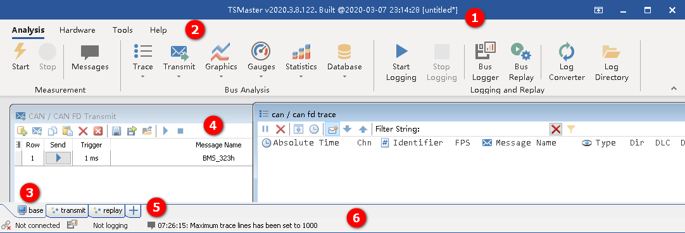
<figcaption>
Fig 1 TSMaster main interface
</figcaption>
</figure>

1.  Application title bar. The application name, build time and loaded
    configuration is shown in this title bar.

2.  Ribbon toolbar. The main functions are accessed from this ribbon
    toolbar.

3.  Page tabs. Each tab contains a set of windows for measurement and
    simulation. User can add or delete window inside the current tab.

4.  Application forms. Each window is a function performing specific
    tasks.

5.  Add page button. User can add new page by clicking this button. If
    user want to delete a page, just right-click on the current page and
    select “delete tab” command.

6.  Status bar. The connection status of application, logging
    information and write information are shown in the status bar.

    1.  Ribbon Functions

There are four tabs in ribbon: Analysis, Hardware, Tools and Help.

2.  Analysis Tab

<figure>
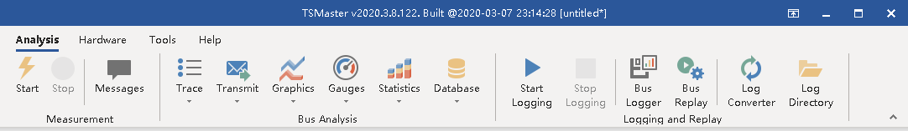
<figcaption>
Fig 2 Analysis tab in Ribbon
</figcaption>
</figure>

**Start**: Start application. This operation will connect all the
logical channels with hardware channels, the data from hardware will be
shown in the application interface.

After application is started, the following functions are not available:

- Bus Replay. Bus replay is only allowed when application is
  disconnected.

- Channel Selection. Channel selection is only available before
  application connection.

- Channel Mapping. Channel mapping information is required before
  application is connectd.

- Network Hardware. Hardware parameters are only allowed to configure
  before application is started.

**Stop**: Stop application. This operation will disconnect all the
logical channels with hardware channels. The logging operation is also
stopped if already running.

After application is stopped, the following functions are now available:

- Bus Replay. User can load logged files and analyze them in the
  application forms.

- Channel Selection. User can map channels freely when application is
  not connected.

- Channel Mapping. User can manage application and channels in the
  channel mapping form.

- Network Hardware. User can alter hardware configuration when
  application is not connected.

**Messages**: Show message window.

**Trace**: This is a drop-down button as shown below:

<figure>
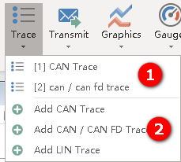
<figcaption>
Fig 3 Trace drop-down button
</figcaption>
</figure>

1.  Trace windows that already exist in the system, click to show one of
    them.

2.  Add new trace window in the system. The default location is the
    current tab.

**Transmit**: Show or add transmit windows for bus message transmission.

**Graphics**: Show or add graphics windows for signal curve display.

**Gauges**: Show or add gauge windows for signal value display.

**Statistics**: Show bus statistics window.

**Database**: Show bus database window, CAN (\*.dbc) and LIN (\*.ldf)
files are supported.

**Start Logging**: Start logging of bus events.

**Stop Logging**: Stop logging of bus events.

**Bus Logger**: Show bus logging configuration window.

**Bus Replay**: Show bus replay window.

**Log Converter**: Show log file converter application which converts
blf file format to asc file format and vice versa.

**Log Directory**: Show the current log file directory in Windows
explorer.

1.  Hardware Tab

<figure>
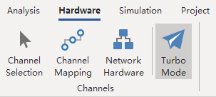
<figcaption>
Fig 4 Hardware tab in ribbon
</figcaption>
</figure>

**Channel Selection**: Open channel selection window for logical channel
mapping with hardware channels.

**Channel Mapping**: Open channel mapping configuration window to manage
application logical channels and mapping.

**Network Hardware**: Open hardware configuration window to configure
individual hardware channel parameters.

**Turbo Mode**: Checking this option will minimize all hardware channel
latencies at the expense of consuming more CPU usage. Users who concern
very much for hardware performance are recommended to check this option.

2.  Project Tab

<figure>
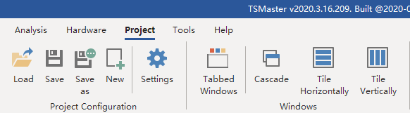
<figcaption>
Fig 5 TSMaster Project Tab
</figcaption>
</figure>

**Load**: Load TSMaster configuration file, this operation will
overwrite all the current settings.

**Save**: Save TSMaster configuration file to a location. If the
destination configuration is specified, the following save command will
update the destination configuration file.

The first time when the button is clicked, a save as dialog will be
prompt for user to select a destination configuration file:

<figure>
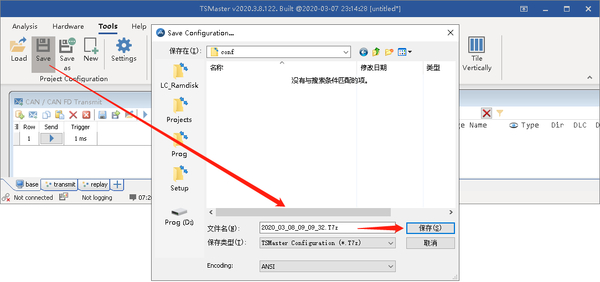
<figcaption>
Fig 6 Save configuration for the first
time
</figcaption>
</figure>

Just specify a location and file name for the configuration file, and
click “Save” button. The application title will display the destination
configuration file name after the configuration file is saved:

<figure>
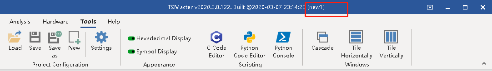
<figcaption>
Fig 7 Configuration file name shown in the title
bar
</figcaption>
</figure>

After the configuration file is saved, each successive save command will
update this file continuously.

**Save as**: This command will popup a save as dialog for the user to
change the configuration file to another location.

**New**: This command will erase all the current configuration and
create a new environment for analysis. Note: please save all your work
into a configuration file before applying this command.

**Settings**: Opens a software configuration window showing all the
opened windows. User can show/hide/delete the application forms in this
window. The title of each application form can also be modified here.

**Tabbed Windows:** This checkbox displays all windows in tabs or vice
versa:

<figure>
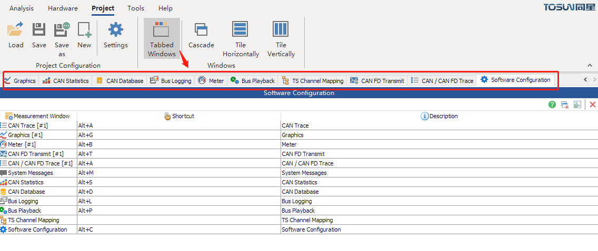
<figcaption>
Fig 8 Tabbed Windows
</figcaption>
</figure>

Note: When this checkbox is checked, the lower tab group disappears
because all the sub forms are displayed in the above tabs.

If this checkbox is unchecked, the lower tab group will be visible again
and each tab group controls a series of sub mdi forms.

**Cascade**: Cascade application forms in the current tab group.

**Tile Horizontally**: Tile all the application forms in the current tab
horizontally.

**Tile Vertically**: Tile all the application forms in the current tab
vertically.

Note: This above features “Cascade, Tile Horizontally and Tile
Vertically” are only available when “Tabbed Windows” feature is
unchecked.

3.  Tools Tab

<figure>
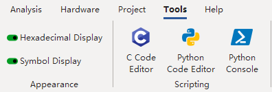
<figcaption>
Fig 9 Tools tab in ribbon
</figcaption>
</figure>

**Hexadecimal Display**: This command toggles display between
hexadecimal and decimal.

**Symbol Display**: This command toggles display between symbol
description and value of a signal in database.

**C Code Editor**: This command opens TSMaster C Code Editor for editing
C scripts.

**Python Code Editor**: This command opens TSMaster Python Code Editor
for editing Python scripts.

**Python Console**: This will open python console window for interacting
with internal python engine shipped with TSMaster.

4.  Help Tab

<figure>
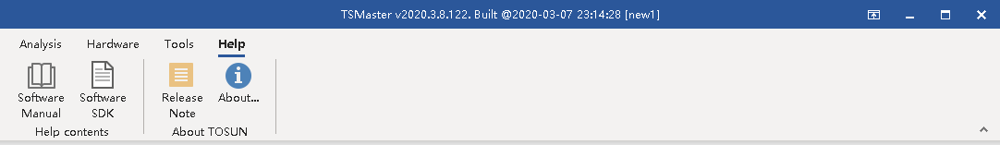
<figcaption>
Fig 10 Help tab in ribbon
</figcaption>
</figure>

**Software Manual**: This software manual will be shown.

**Software SDK**: TSMaster API description manual will be shown.

**Release Note**: This will open release note for the current version of
TSMaster.

**About…**: This will show about dialog of TOSUN company.

5.  Application Shortcuts

- Ctrl + O: Open project

- Ctrl + N: Create new project

- Ctrl + S: Save the current project

- Ctrl + TAB: move to next tab in Tabbed windows mode

- Ctrl + Shift + TAB: move to previous tab in Tabbed windows mode

- Ctrl + W: close the current active window or tab

  1.  Univeral Drag and
      Drop

TSMaster support many different automotive bus database types to be
dragged and droped into TSMaster application main interface.

<figure>
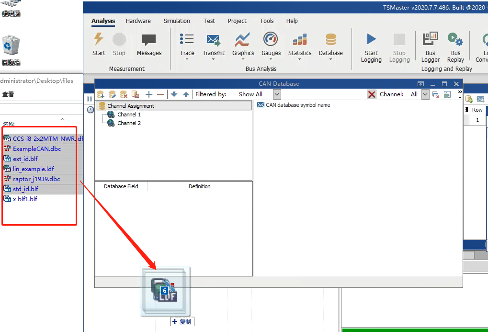
<figcaption>
Fig 11 Universal drag ang drop in
TSMaster
</figcaption>
</figure>

The supported suffixes of file types are listed below:

Table 1 File formats that support drag and drop

| File extension | Associated Vendor | File Description |
|:--:|:--:|----|
| blf | Vector | Binary logging format of different bus systems |
| dbc | Vector | CANdb network file |
| ldf | ISO | LIN description file |
| mpc | TOSUN | TSMaster mini program source file extension |
| t7z | TOSUN | TSMaster project file |
| mp | TOSUN | TSMaster mini program compiled binary file |
| arxml | AutoSAR | AutoSAR system description file |
| dbf | ETAS | Bus Master file format |
| sym | PEAK | PEAK PCAN CAN description file |
| mat | Mathworks | MATLAB file format used in TOSUN calibration module |
| mp4 | MPEG-4 Part 14 | ISO/IEC 14496-12(MPEG-4 Part 12 ISO base media file format), used in Video Replay |
| avi | Microsoft | Audio Video Interleave, a widely used video file format created by Microsoft in 1992, used in Video Replay |
| wmv | Microsoft | A video file based on the Microsoft Advanced Systems Format (ASF) container format, used in Video Replay |
| mpeg | ISO and IEC | Moving Picture Experts Group (MPEG), used in Video Replay, used in Video Replay |
| mpg | ISO and IEC | Moving Picture Experts Group (MPEG), used in Video Replay, used in Video Replay |
| m4v | Apple | A video container format developed by Apple and is very similar to the MP4 format, used in Video Replay |
| mov | Apple | A movie file saved in the QuickTime File Format (QTFF), which is a multimedia container file format, used in Video Replay |
| asf | Microsoft | The container format for Windows Media Audio and Windows Media Video-based content, used in Video Replay |
| flv | Adobe | A file format used by Adobe Flash Player and Adobe AIR to store and deliver synchronized audio and video streams over the Internet, used in Video Replay |
| f4v | Apple | A Flash MP4 Video file, sometimes called an MPEG-4 Video file, used in Video Replay |
| rmvb | RealNetworks | RealMedia Variable Bitrate (RMVB) is a variable bitrate extension of the RealMedia multimedia digital container format, used in Video Replay |
| rm | RealNetworks | RealMedia is a proprietary multimedia container format created by RealNetworks. Its extension is ". rm", used in Video Replay |
| 3gp | 3rd Generation Partnership Project | A 3GP file is a multimedia file saved in an audio and video container format, used in Video Replay |
| vob | DVD Forum | A movie data file from a DVD disc, typically stored in the VIDEO_TS folder at the root of the DVD, used in Video Replay |

1.  Channel Selection

<figure>
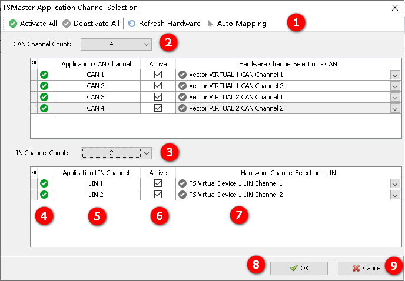
<figcaption>
Fig 12 Channel Selection dialog
</figcaption>
</figure>

Channel selection dialog is used to quick configure application channel
mapping before application is running.

1.  Toolbar buttons described below:

> **Activate All**: Activate all the application channels
>
> **Deactivate All**: Deactivate all the application channels
>
> **Refresh Hardware**: Refresh hardware channel list after USB devices
> are plugged in or out
>
> **Auto Mapping**: Automatically search hardware channels and map each
> application channel with available hardware channel in the order of
> discovery.

2.  **Application CAN channel count**: Displays the current CAN channel
    count of TSMaster, the user can change it using drop-down button,
    the modification takes effect immediately.

3.  **Application LIN channel count**: Displays the current LIN channel
    count of TSMaster, the user can change it using drop-down button,
    the modification takes effect immediately.

4.  **Availability**: Indicates the availability of the current
    application channel. The color of the icon has the following
    meaning:

>  This application channel mapping is
> valid. The corresponding application is fully functional during
> measurement.
>
>  This application channel is disabled. The
> corresponding application channel is not available during measurement.
>
>  style="width:0.20831in;height:0.18748in" /> This application channel
> is invalid, the user must resolve the mapping problem, otherwise the
> application cannot start.

5.  **Application channel**: Application logical channel specified by
    user. Each application channel number has an ascending order
    starting from 1. The available application channels are from 1 to
    CAN channel count.

6.  **Active Selection**: This checkbox controls the availability of the
    current application channel. Default selection is checked. If user
    wants to disable the current application channel, the selection can
    be unchecked. After that, the mapping of this application channel
    will not be available during measurement.

7.  **Hardware channel selection drop-down box**: This drop-down box
    lists all the available hardare channels that can be mapped with the
    current application channel. The color of each item listed has the
    following meaning:

>  style="width:0.20764in;height:0.18819in" /> This hardware channel is
> not mapped with other application channels, it is free for user to
> select.
>
>  style="width:0.20764in;height:0.19514in" /> This hardware channel is
> already mapped with one application channel. Multiple application
> channels mapping to the same hardware channel is not allowed.
>
>  style="width:0.20831in;height:0.18748in" /> This application channel
> is not mapped with any hardware channel, the user must ensure the
> mapping of the application channel before measurement starts.

Note: If TSMaster is opened for the first time, when user tries to
connect application without opening this dialog, a default configuration
is automatically applied, which performs the following operations:

\[1\] search for available CAN and LIN hardware channels excluding TS
virtual channels

\[2\] set application CAN and LIN channels according to the first found
hardware channels

\[3\] start application for the measurement

1.  System Messages Window

System messages window displays all the software related messages, the
message color has the following meaning:

 Default: Normal message

 Verbose: Message of minor importance

 Hint: Message that should to come into
notice

 OK: Message that indicates the current
operation is successful

 Error: The current operation encounters an
error

The description of system message window is shown below:

<figure>
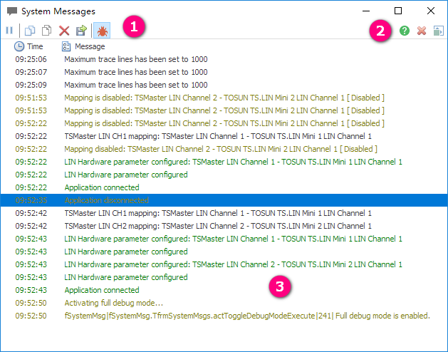
<figcaption>
Fig 13 System Message Window
</figcaption>
</figure>

1.  **Toolbar buttons**

 Pause checkbox, check to suppress the
display of incoming messages

 Copy the selected logs into clipboard

 Copy all the logs into clipboard

 Clear the display of the current window,
this will delete all the logs

 Save the log to a file on the disk

 Debugging mode switch, check to open debug
mode, each log message will then contain stack trace info.

2.  **Common window buttons**

 Opens help document for the current window

 Delete or hide the current window, if the
user selects “Delete”, the window will be destroyed and will not appear
in any of the application tabs; if the user selects “Hide”, the window
will be hidden in the current tab, but may be displayed in other tabs.
Note: the default operation of closing a window by clicking on the
right-top red button of a window  is to hide it.

3.  **Logging area**: The time and description of events are displayed
    here.

    1.  CAN / CAN FD Trace

> CAN / CAN FD Trace window display events from CAN / CAN FD networks.

<figure>
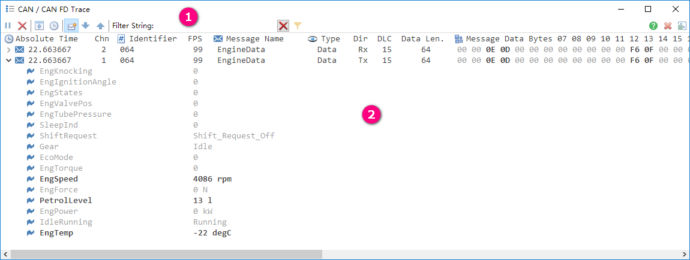
<figcaption>
Fig 14 CAN / CAN FD Trace Window
</figcaption>
</figure>

1.  Trace toolbar

>  Pause display button, when checked, the
> “Pause” button will switch to “Continue”
>  style="width:0.24997in;height:0.23955in" /> and incoming events will
> not be refreshed on the screen. The incoming events will be visible
> again when the “Continue” button is clicked.
>
>  Clear the display of the current trace
> window.
>
>  This checkbox sets trace window in
> chronological view mode. In this mode every incoming new message will
> be display as one trace line.
>
>  This checkbox sets trace window in
> relative time mode.
>
>  This checkbox ensures the trace list
> always scroll to the latest message.
>
>  Expand all message nodes to view their
> signal values.
>
>  Collapse all message nodes so signals are
> hidden.
>
>  style="width:3.12461in;height:0.20831in" /> Filter trace list with
> specified string, the filter string can be the following types:

<figure>
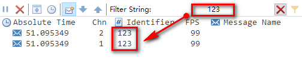
<figcaption>
Fig 15 Filter by identifier
</figcaption>
</figure>

<figure>
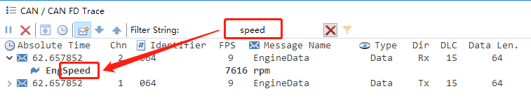
<figcaption>
Fig 16 Filter by signal name
</figcaption>
</figure>

<figure>
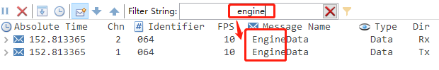
<figcaption>
Fig 17 Filter by message name
</figcaption>
</figure>

<figure>
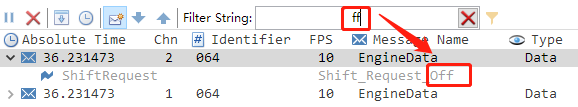
<figcaption>
Fig 18 Filter by signal symbol value
</figcaption>
</figure>

<figure>
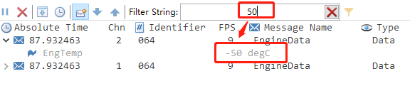
<figcaption>
Fig 19 Filter by signal numeric value
</figcaption>
</figure>

>  Clear filter value, the trace list will
> then display all the trace lines.
>
>  Message filter tool, which allows
> specific message identifiers to display in the trace, and meanwhile
> blocks other message identifiers. User can use this message filter to
> hide some irrelevant messages, or just monitor certain messages.

2.  Trace message
    identifier filter

<figure>
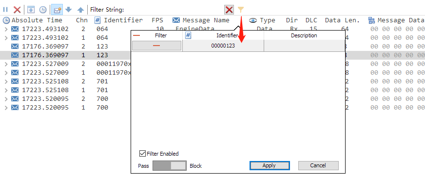
<figcaption>
Fig 20 Trace message identifier filter
</figcaption>
</figure>

> The trace message identifier filter works under either of the two
> conditions:

1.  Block mode 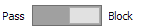

The message identifier in the list will be blocked, and other message
will pass the fiter. In the above picture, only 0x123 will be blocked,
while other message identifiers will be displayed in the trace window.

2.  Pass mode 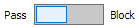

The message identifier in the list will be passed, and other message
will be blocked. In the following picture, only 0x123 will be refreshed
in the trace list:

<figure>
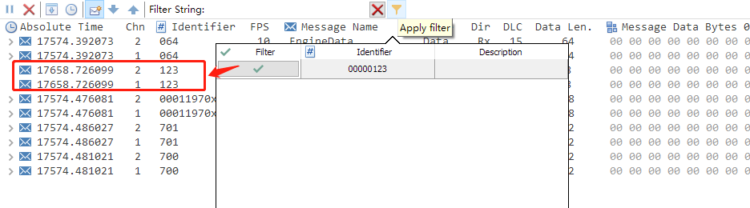
<figcaption>
Fig 21 Message identifier filter working in pass
mode
</figcaption>
</figure>

To add or delete message identifiers in the list, just right-click on
the empty area of the list, you will see the following popup menu items:

<figure>
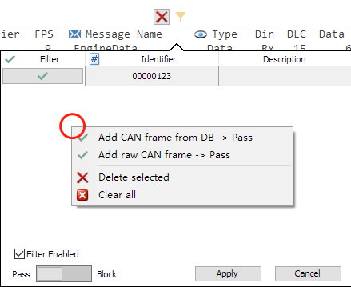
<figcaption>
Fig 22 Add or delete message identifiers in the
list
</figcaption>
</figure>

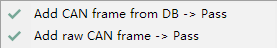 Add CAN frame identifiers
from database or on the fly. These added message identifiers will be
passed to the trace list. These menu items will be shown when the filter
is in pass mode.

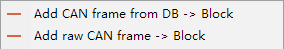 Add CAN frame identifiers
from database or on the fly. These added message identifiers will be
blocked and will not be displayed in the trace list. These menu items
will be shown when the filiter is in block mode.

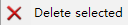 This operation will remove
the selected message identifier from the filter list.

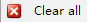 This operation clears all
the message identifier items from the filter list.

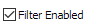 This checkbox controls
whether the message identifier filter is enabled or not.

1.  Trace list columns

**Absolute Time**: Absolute measurement time in seconds, this is the
default time display format. The absolute time or message will be
displayed in this column.

**Relative Time**: The relative time indicates the time in relation to
the preceding message. In chronological mode this is the message
received directly before the current message, whereas in fixed position
mode the relative time is displayed in relation to the previous message
of the same type.

**Chn**: The channel number of the message.

**Identifier**: CAN message identifier, extended identifier format will
add a “x” symbol to the identifier value.

**FPS**: Frames per second, this column displays the frame rate of
specific identifier.

**Message Name**: The name of the message defined in the database.

**Type**: CAN message type will be displayed here including the
following:

- Data: Classical CAN data frame

- Remote: Classical CAN remote frame

- FD: CAN FD frame

**Dir**: Direction of the CAN message, can be Tx (transmit) or Rx
(receive)

**DLC**: Data length code from CAN messages, in CAN FD frame the DLC has
the following relationships with the length of data bytes:

| DLC | Data length |
|:---:|:-----------:|
| 0~8 | Same as DLC |
|  9  |     12      |
| 10  |     16      |
| 11  |     20      |
| 12  |     24      |
| 13  |     32      |
| 14  |     48      |
| 15  |     64      |

**Data Len**: The length of data bytes.

**Message Data Bytes**: Each data byte of the message. In CAN FD frame,
the data byte can be larger than 8 bytes, each data byte with index
starting from 0 is shown:

<figure>
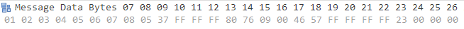
<figcaption>
Fig 23 Message data bytes with index starting from
0
</figcaption>
</figure>

1.  Trace Signals Display

Trace signals can be expanded if a message is defined in the loaded CAN
database:

<figure>
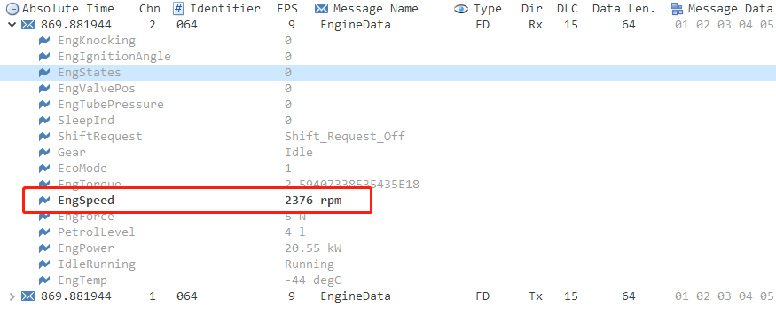
<figcaption>
Fig 24 Signals with updated values
highlighted
</figcaption>
</figure>

2.  Popup Menus

Most of trace popup menu items can be found in trace toolbar except
“Copy” and “Block selected message”:

<figure>
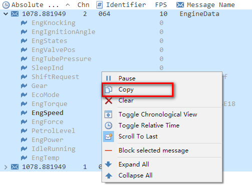
<figcaption>
Fig 25 Trace popup menu
</figcaption>
</figure>

To copy the trace lines, the user has to select certain trace lines and
then click the “Copy” item. The selected text has the same layout as
trace display:

<figure>
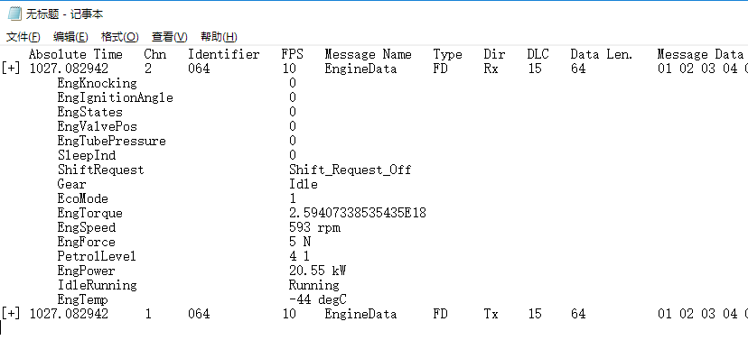
<figcaption>
Fig 26 Selected trace lines in text
</figcaption>
</figure>

1.  CAN / CAN FD Transmit
    Window

CAN / CAN FD frames can be transmitted manually or periodically by CAN /
CAN FD transmit window:

<figure>
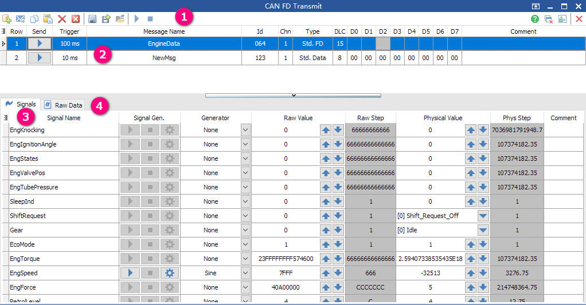
<figcaption>
Fig 27 CAN / CAN FD Transmit Window
</figcaption>
</figure>

1.  Transmit toolbar

 Add a CAN message from database.

 Add a raw CAN message directly into
transmit list, which can be freely modified.

 Copy selected CAN messages into clipboard,
which can be pasted into current transmit list.

 Paste the copied CAN message from clipboard
into the current transmit list.

 Delete the selected CAN messages from
current list

 Remove all the CAN messages from current
list.

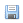 Save the current transmit list to an
external file. For the first time a save dialog box appears for the user
to specify destination file. The following save operations will
overwrite this file.

 Export the current transmit list to an
external file.

 Load transmit list from external file, this
operation will overwrite all the existing transmit list.

 Start the transmission of the current
transmit list. Note: this operation will send all the frames inside the
transmit list, for manual transmit messages, only one frame is sent per
message; for cyclic transmit messages, all of them are scheduled to be
sent periodically.

 Stop all the periodically transmitted
messages. Note: this operation will be executed everytime when
application disconnects.

2.  Transmit list

The transmit list contains messages to be edited, each message has the
following properties:

**Row**: The number of each transmit message in ascending order, this
field is read-only and cannot be edited.

**Send**: This is a button controlling the current message transmission.
The style of this button depends on the trigger type of the current
message:

- Manal transmit message: Each click on this button will trigger one CAN
  message transmission.

- Periodic transmit message: The first click on this button will start
  the cyclic transmission of this message. The transmit button will then
  switch to a “Stop” button:  The next click on this
  stop button will stop the cyclic transmission of the current message.

**Trigger**: Message transmission type:

- Manual: One click on the “Send” button will trigger one CAN message
  transmission

- Periodic: Periodic transmission type has the following properties:

<figure>
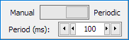
<figcaption>
Fig 28 Periodic transmission type
configuration
</figcaption>
</figure>

The period can be within range from 1ms to 1000000000ms.

**Message Name**: The name of the message, if this message is added from
CAN database, then the message name is defined by CAN database and
cannot be modified by user; if this message is added manually, then the
name of the message can be freely altered by user.

**Id**: Identifier of CAN message.

**Chn**: The channel number of CAN message.

**Type**: CAN frame type, can be the one of the following 6 types:

- Std. Data: Classical CAN data frame with standard identifier

- Std. Remote: Classical CAN remote frame with standard identifer

- Std. FD: FD frame with standard identifier

- Ext. Data: Classical CAN data frame with extended identifier

- Ext. Remote: Classical CAN remote frame with extended identifier

- Ext. FD: FD frame with extended identifier

**DLC**: Data length code of the CAN message, which can be within range
0~15.

**D0~D7**: Classical CAN data frame data byte editors. Note: In FD CAN
frame, these editors are unavailable and replaced by “Raw Data” editors
located on the bottom panel.

1.  Signals list

Signals list displays editors for modifying signal properties of the
selected CAN message defined in CAN database. The raw CAN messages do
not have signals list editors.

<figure>
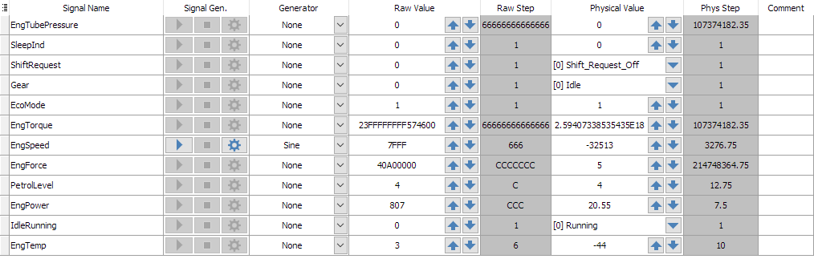
<figcaption>
Fig 29 Signals list of the selected CAN
message
</figcaption>
</figure>

2.  Signal Name

The signal name defined in the CAN database.

3.  Signal Gen.

The signal value generator feature, which has three buttons for sending
and configuring the value changing behavior of each CAN signal:

-  Start generating of the current signal.
  Once this button is clicked, the button changes to “Pause” button
  shown below.

-  Pause button, once this button is
  clicked, the current CAN signal generator pauses, the button then
  changes back to “Send” button shown above.

-  Stop button, a click on this button stop
  the operation of the current CAN signal generator.

  1.  Generator

This combobox specifies the generator type of the current CAN signal,
which has the following choices:

- None: No CAN signal generator is available, the signal value in the
  sent CAN message depends on the physical value set on the “Physical
  Value” on the right side.

- Ramps and Pulses:

<figure>
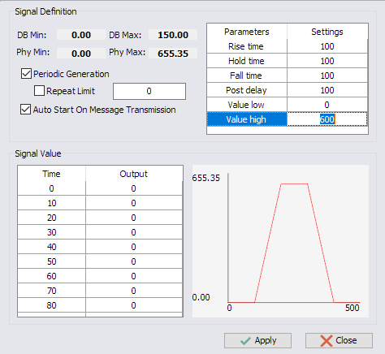
<figcaption>
Fig 30 Ramps and Pulses signal generator
</figcaption>
</figure>

The selected CAN signal will be generated in the time series of
Rise-Hold-Fall-Delay. The high value, low value and each time segment
can be modified.

- DB Min and Max: The minimum and maximum value defined in the database.

- Phy Min and Max: The physical minimum and maximum value that the
  signal can reach.

- Periodic Generation: The signal generator can restart itself when a
  period of value has been generated.

- Repeat Limit: The restart count of periodic generation, if not
  specified, the restart count of periodic generation is unlimited. This
  limit number depends on the activation status of “Periodic
  Generation”.

- Auto Start On Message Transmission: The signal generator will
  automatically start when the parent message is scheduled to be
  transmitted periodically.

- Signal Value table: The signal value table defines each signal
  physical value against time in milliscends. The table is read-only
  except custom signal generator.

- Parameter list: The signal waveform depends the parameters defined in
  this table.

- Signal waveform preview: The signal value being generated by this
  generator can be previewed in a time-value view here.

<!-- -->

- Value Range

<figure>
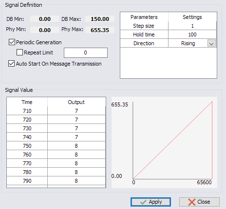
<figcaption>
Fig 31 Value range signal generator
</figcaption>
</figure>

The value range generator traverses the signal value in “Rising”,
“Falling” and “Alternate” methods.

- Toggle

<figure>
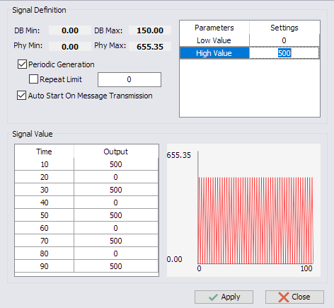
<figcaption>
Fig 32 Toggle signal generator
</figcaption>
</figure>

The toggle signal generator changes the signal value between low and
high. The low and high value can be specified by the user.

- Random

<figure>
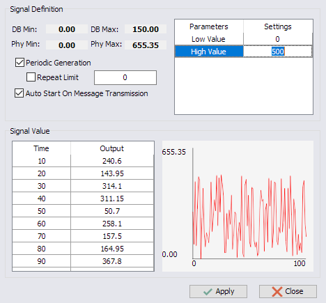
<figcaption>
Fig 33 Random signal generator
</figcaption>
</figure>

The random signal generator outputs random signal values. The low value
and high value of the random range can be specified.

- User Defined

<figure>
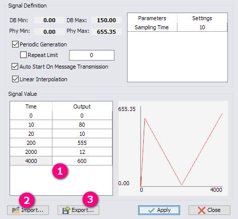
<figcaption>
Fig 34 User defined signal generator
</figcaption>
</figure>

User defined signal generator provides an interface for the user to
interact with the signal values. The user can make the waveform from
external software such as excel, and then import the waveform data into
the transmission value table.

1.  **Signal Value table**: To append a new value into the table, press
    “Down” key. To insert a new value before the selected value in the
    table, press “Insert” key. Note: the time series in the table must
    be in ascending order, otherwise the generator will stop on the
    incorrect time.

2.  **Import button**: The user can import signal waveform defined
    externally. The waveform data file should have the extension of
    “\*.sig” and should have the following format:

<figure>
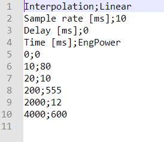
<figcaption>
Fig 35 User defined signal generator import file
format
</figcaption>
</figure>

Line 1: Interpolation method, only Linear is supported currently.

Line 2: Sample rate in milliseconds. Note: the charactor “;” is the
separator between the key and value in the “key - value” pair.

Line 3: Delay time in milliseconds.

Line 4: Table description of the following “key - value” pair.

Line 5 and the following: Table data defined in “key - value” pair which
are separated by “;” character.

3.  **Export button**: The export feature of the signal generator, which
    will export the current table value into a “\*.sig” file.

    1.  Raw Value

Raw value editor of the current selected signal. To modify a signal’s
raw value without touching its physical value, use this editor.

 Increment and decrement
button of the raw value. Clicking on the corresponding button increments
or decrements the raw value by the step defined on the “Raw Step” field.

2.  Raw Step

The increment or decrement step of the “Raw Value” field.

3.  Physical Value

Physical value editor of the current selected signal. To modify a
signal’s physical value without touching its raw value, use this editor.

 Increment and decrement
button of the physical value. Clicking on the corresponding button
increments or decrements the physical value by the step defined on the
“Phys Step” field.

4.  Phys Step

The increment or decrement step of the “Physical Value” field.

5.  Comment

User comment on the specified signal.

1.  CAN Statistics

    1.  CAN Statistics
        list

<figure>
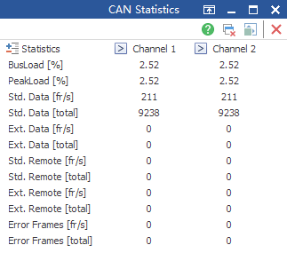
<figcaption>
Fig 36 CAN Statistics
</figcaption>
</figure>

CAN Statistics window displays bus load and frame rate of each CAN
channel. The following value can be monitored:

Bus Load: CAN bus load in percentage.

Peak Load: CAN bus peak load from the start of measurement in
percentage.

Std. Data \[fr / s\]: Standard classical CAN data frame rate per second.

Std. Data \[total\]: Total number of classical standard CAN data frame.

Ext. Data \[fr / s\]: Extended classical CAN data frame rate per second.

Ext. Data \[total\]: Total number of classical extended CAN data frame.

Std. Remote \[fr / s\]: Standard classical CAN remote frame rate per
second.

Std. Remote \[total\]: Total number of remote classical CAN remote
frame.

Ext. Remote \[fr / s\]: Extended classical CAN remote frame rate per
second.

Ext. Remote \[total\]: Total number of extended classical CAN remote
frame.

Error frames \[fr / s\]: CAN error frame rate per second.

Error frames \[total\]: Total number of CAN error frames.

2.  CAN statistics popup
    menu

<figure>
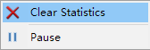
<figcaption>
Fig 37 CAN statistics popup menu
</figcaption>
</figure>

Clear Statistics: Clear all the statistics data immediately.

Pause: Pause the display of current CAN statistics data.

2.  Graphics

Graphics window displays signals from CAN, CAN FD and LIN messages.

<figure>
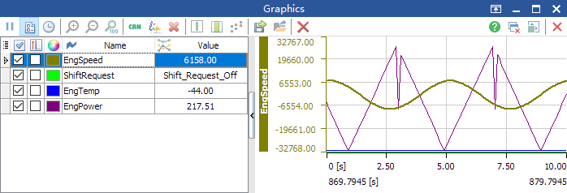
<figcaption>
Fig 38 Graphics
</figcaption>
</figure>

1.  Graphics toolbar

 Pause the display of graphics, the next
click on this button will resume the display of graphics.

 This checkbox controls the display of left
signal list panel.

 Absolute time and relative time switch box,
when enabled, the time axis in the graphics will switch to a formatted
date time display:

<figure>
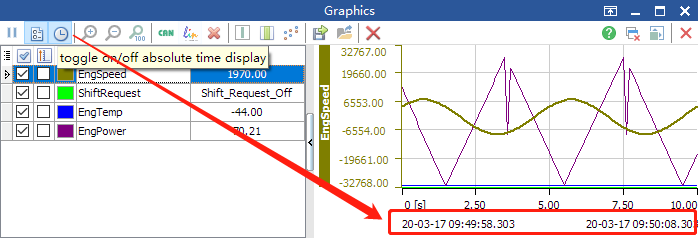
<figcaption>
Fig 39 Formatted date time display of time
axis
</figcaption>
</figure>

When disabled, the time axis will display relative time relative to the
beginning of measurement.

 Zoom in button, click to zoom in the
graphic display in time.

 Zoom out button, click to zoom out the
graphic display in time.

 Zoom reset button, click to set the
graphics display to original zoom factor.

 Add a CAN signal from database.

 Add a LIN signal from database.

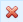 Delete the selected signal in the list.

 This checkbox displays or hides the
measurement cursor. When this checkbox is checked, a measurement cursor
will be displayed on the graphics window, which displays the selected
signal value according to the measurement time. Move the cursor across
the graphic area, you will see the value displayed in the measurement
cursor being continuously updated. Uncheck this checkbox hids the
measurement cursor.

<figure>
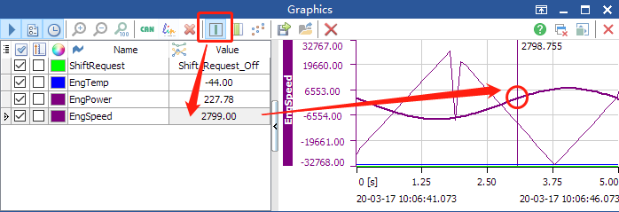
<figcaption>
Fig 40 Graphics measurement cursor
</figcaption>
</figure>

 Time measurement cursor
checkbox. This checkbox shows or hides the time measurement cursor pair.

<figure>
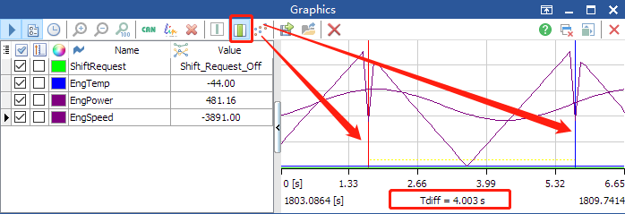
<figcaption>
Fig 41 Time measurement cursor checkbox
</figcaption>
</figure>

When the time measurement cursor is enabled, the user can define a time
range between blue cursor and red cursor. “Left click” on the graphics
window drops a blue cursor to the location of the click point, and
“Right click” on the graphics window drops a red cursor to the location
of the click point. The delta time between blue cursor and red cursor
will then be displayed on the bottem area of time axis in the graphics
window.

 Sample point display. When
this checkbox is checked, each sample point will be displayed in the
graphics window, it is easy for the user to detect frame loss situation
with the help of the samle point display.

Fig 42 Sample point display

 Export graphics data to an external
location. Note: this button is only enabled when application
disconnects.

 Import graphics data from an external
location. Note: this button is only enabled when application
disconnects.

 Clears all the data in the
graphics.

2.  Graphics signal list

<figure>

<figcaption>
Fig 43 Graphics signal list
</figcaption>
</figure>

 Signal visibility checkbox, the signal
will be set to hidden when this checkbox is unchecked.

 Always show value axis
checkbox, if the checkbox is checked, the value axis of the specified
signal will be displayed in the graphics window permanently.

<figure>

<figcaption>
Fig 44 Signal axis display
</figcaption>
</figure>

 Color picker. Clicking on this button will
popup a dialogbox for the user to pick a color for the specified signal:

<figure>

<figcaption>
Fig 45 Color picker of graphic signals
</figcaption>
</figure>

 Signal name field, this
field displays signal name according to the database definition.

 Signal value field, this field display
real-time signal physical value.

3.  Signal property
    inspector

Signal property inspector will be popuped when the signal in the list is
double-clicked, or the “Edit Signal…” menu item is clicked. Take “CAN
signal property inspector” as an example:

<figure>

<figcaption>
Fig 46 Signal properties inspector
</figcaption>
</figure>

The following properties can be displayed or modified by user freely:

Name: the signal name

Length: the bit count of the signal

Byte Order: Intel or Motorola byte order switch of the signal

Value Type: the value type can be Unsigned, Signed, 32-bit float or
64-bit float

Minimum: the minimum physical value of the signal, this value also
adjusts the lower range of graphics display

Maximum: the maximum physical value of the signal, this value also
adjusts the higher range of graphics display

Unit: the unit of the signal

Factor: enlarge factor of the signal

Offset: offset value of the signal

Init. Value: initialize value of the signal

Comment: the user can add comments on the specified signal

Start Bit: the signal start bit in the message which contains it

Message ID: the identifier of the message which contains it

Channel Number: the CAN channel number of the signal

4.  Signal Popup menu

<figure>

<figcaption>
Fig 47 Graphics signal popup menu
</figcaption>
</figure>

Check selected: Make all the selected signals visible in the graphics.

Uncheck selected: Make all the selected signals invisible in the
graphics.

Check All: Make all the signals visible in the graphics.

Uncheck All: Make all the signals invisible in the graphics.

Add CAN signal from database…: This button popup a CAN database signal
selector for the user to select CAN signals to monitor.

Add LIN signal from database…: This button popup a LIN database signal
selector for the user to select LIN signals to monitor.

Add user defined signal…: This button adds a custom signal in the list,
which can be modified later.

Edit Signal…: Popups the “Signal property inspector” as described above.

Delete Signal: This buttonj deletes all the selected signals from the
list.

Clear All Signals: This button deletes all the signals from the list.

Pause Graphics: This button pauses the display of the current graphics
window, a click on this button again will resume the display of the
current graphics window.

3.  CAN Database

CAN database viewer can be used to load/unload CAN database, select CAN
messages or CAN signals in the TSMaster application.

<figure>

<figcaption>
Fig 48 CAN Database
</figcaption>
</figure>

1.  CAN database toolbar

 Add a CAN database from external \*.dbc
file

 Edit the current selected database (\*.dbc
file) using default editor on this computer

 Delete the current selected database from
the database list

 Delete all the database links from the
database list

 Increase a channel resource for database
file mapping

 Decrease a channel resource for database
file mapping

 Expand all nodes in the database treeview

 Collapse all nodes in the database
treeview

Filter by: database element filter, can be the following for user to
select in database element selector mode:

- Show All: all the database elements will be displayed in the treeview

- CAN Signal: Only CAN signals are displayed

- CAN Message: Only CAN messages are displayed

- CAN Node: Only CAN nodes are displayed

- Envrionment Variable: Only environment variables are displayed

  1.  CAN database channel
      assignment

CAN database channel assignment enables the user to associate the
selected database with specific CAN channels. A CAN database can support
only one CAN channel, or multiple channels.

<figure>

<figcaption>
Fig 49 Channel assignment
</figcaption>
</figure>

When there are multiple database files loaded, the user may right-click
on the specific CAN channel, which popups a list of available CAN
databases. The user can associate / deassociate the database with the
currently selected CAN channel by clicking on the database item in the
popup menu.

2.  CAN Database field
    viewer

<figure>

<figcaption>
Fig 50 CAN database field viewer
</figcaption>
</figure>

The CAN database field viewer is used to display properties of the
selected element, which can be CAN signal, CAN message, CAN node,
environment variable or CAN network.

Note: the CAN database field viewer currently not supports editing of
CAN elements.

3.  CAN element treeview

<figure>

<figcaption>
Fig 51 CAN element treeview
</figcaption>
</figure>

The CAN element treeview displays all the loaded CAN database
information including CAN network, CAN signals, CAN messages, CAN nodes
and Environment variables.

1.  Hardware Configuration

The hardware configuration window is used to set hardware parameters
before measurement starts.

1.  Configuration Page

The configuration page contains all the application channels specified
by user. There is a button which opens channel selection dialog
mentioned above.

<figure>

<figcaption>
Fig 52 Hardware Configuration page
</figcaption>
</figure>

2.  Channel configuration
    page

The channel configuration page differs when different application
channel is selected. The user must check the hardware settings in each
channel before starting the measurement.

<figure>

<figcaption>
Fig 53 Hardware channel settings
</figcaption>
</figure>

2.  Bus Logging

<figure>

<figcaption>
Fig 54 Bus logging
</figcaption>
</figure>

1.  Bus logging toolbar

 Start logging, this button is disabled
when logging engine is working.

 Pause logging, this button is enabled when
logging engine is working.

 Stop logging, this button is enabled when
logging engine is working.

 Log file destination editor.

 Select log file location.

 Opens folder of log file destination.

 Starts TS log file converter to convert
log files to another format.

 Default path checkbox, if
this checkbox is checked, the log file destination folder will be set to
relative folder to TSMaster configuration file.

 Auto add timestamp to every
log file name.

2.  Bus logging popup menu

<figure>

<figcaption>
Fig 55 Bus logging popup menu
</figcaption>
</figure>

The popup menu will popups when user right-click on the log file list.
All the menu items are described in the above chapter.

3.  Bus Playback

Bus playback window replays CAN, CAN FD and LIN messages from external
log files when the application is not connected.

<figure>

<figcaption>
Fig 56 Bus playback
</figcaption>
</figure>

1.  Bus playback toolbar

 Starts playback. This button is not
enabled when application is connected.

 Pause playback. This button
is enabled when playback starts.

 Stop playback. This button is enabled when
playback starts.

 Add playback files to the log file list.

 Remove the selected log files from the
list.

 Remove all the log files from the list.

2.  Bus playback popup
    menu

<figure>

<figcaption>
Fig 57 Bus playback popup menu
</figcaption>
</figure>

The menu items are described in the above chapter except:

Open containing folder…: Open the folder which contains the selected log
file.

Rename…: Popups a rename dialog box for the user to rename the selected
log file.

3.  Playback control

<figure>

<figcaption>
Fig 58 Bus playback control
</figcaption>
</figure>

 Playback progress indication.

 Playback range selection.

4.  Meter

Meter displays CAN or LIN signals defined in CAN or LIN databases.

<figure>

<figcaption>
Fig 59 Meter
</figcaption>
</figure>

1.  Meter toolbar

 Pause display of meter signals, when
checked, all the meter signals refresh tasks are paused.

 Add a CAN signal from database.

 Add a LIN signal from database.

 Enable customization of the
layout of meters.

 Select meter display style.

 Delete the selected meter signals.

 Delete all the signals in meter window.

2.  Meter Layout Control

You can simply click customization button
 to control each meter layout:

<figure>

<figcaption>
Fig 60 Meter Control customization
</figcaption>
</figure>

Then you can directly drag and drop each meter to your desired location:

<figure>

<figcaption>
Fig 61 Meter Control drag and drop
</figcaption>
</figure>

After the customization window is closed, you are leaving the
customization mode.

Another way to quick customize the meter is to directly drag the caption
area of each meter to align it:

<figure>

<figcaption>
Fig 62 Drag caption area to align it
</figcaption>
</figure>

3.  Meter signal editor

<figure>

<figcaption>
Fig 63 Meter signal editor
</figcaption>
</figure>

Name: the name of the signal to be displayed.

Length: signal bit count.

Byte Order: can be Intel or Motorola.

Value Type: can be Unsigned, Signed, 32-bit float or 64-bit float.

Minimum: the minimum physical value of the signal, this setting also
affects the graphical minimum range.

Maximum: the maximum physical value of the signal, this setting also
affects the graphical maximum range.

Unit: the unit of signal physical value.

Factor: the enlarge factor of the physical value of signal.

Offset: the offset value of the physical value of the signal.

UI Size in width and height: user can adjust the size of the meter by
modifying these parameters.

Switch Type: the following types are supported:

<figure>

<figcaption>
Fig 64 The type of meter display
</figcaption>
</figure>

5.  LIN Trace

    1.  Trace toolbar

>  style="width:0.22708in;height:0.24028in" /> Pause display button, when
> checked, the “Pause” button will switch to “Continue”
>  style="width:0.24997in;height:0.23955in" /> and incoming events will
> not be refreshed on the screen. The incoming events will be visible
> again when the “Continue” button is clicked.
>
>  style="width:0.24028in;height:0.24028in" /> Clear the display of the
> current trace window.
>
>  style="width:0.25347in;height:0.24028in" /> This checkbox sets trace
> window in chronological view mode. In this mode every incoming new
> message will be display as one trace line.
>
>  style="width:0.25347in;height:0.24028in" /> This checkbox sets trace
> window in relative time mode.
>
>  style="width:0.25347in;height:0.24028in" /> This checkbox ensures the
> trace list always scroll to the latest message.
>
>  style="width:0.24028in;height:0.24028in" /> Expand all message nodes
> to view their signal values.
>
>  style="width:0.22083in;height:0.22083in" /> Collapse all message nodes
> so signals are hidden.
>
>  style="width:3.12461in;height:0.20831in" /> Filter trace list with
> specified string, the filter string can be the following types:

<figure>

<figcaption>
Fig 65 Filter by identifier
</figcaption>
</figure>

<figure>

<figcaption>
Fig 66 Filter by signal name
</figcaption>
</figure>

<figure>

<figcaption>
Fig 67 Filter by message name
</figcaption>
</figure>

<figure>

<figcaption>
Fig 68 Filter by signal symbol value
</figcaption>
</figure>

<figure>

<figcaption>
Fig 69 Filter by signal numeric value
</figcaption>
</figure>

>  style="width:0.20764in;height:0.20764in" /> Clear filter value, the
> trace list will then display all the trace lines.
>
>  style="width:0.22083in;height:0.20764in" /> Message filter tool, which
> allows specific message identifiers to display in the trace, and
> meanwhile blocks other message identifiers. User can use this message
> filter to hide some irrelevant messages, or just monitor certain
> messages.

2.  Trace message
    identifier filter

<figure>

<figcaption>
Fig 70 Trace message identifier filter
</figcaption>
</figure>

> The trace message identifier filter works under either of the two
> conditions:

3.  Block mode 

The message identifier in the list will be blocked, and other message
will pass the fiter. In the above picture, only 0x12 will be blocked,
while other message identifiers will be displayed in the trace window.

4.  Pass mode 

The message identifier in the list will be passed, and other message
will be blocked. In the following picture, only 0x12 will be refreshed
in the trace list:

<figure>

<figcaption>
Fig 71 Message identifier filter working in pass
mode
</figcaption>
</figure>

To add or delete message identifiers in the list, just right-click on
the empty area of the list, you will see the following popup menu items:

<figure>

<figcaption>
Fig 72 Add or delete message identifiers in the
list
</figcaption>
</figure>

 Add LIN frame identifiers
from database or on the fly. These added message identifiers will be
passed to the trace list. These menu items will be shown when the filter
is in pass mode.

 Add LIN frame identifiers
from database or on the fly. These added message identifiers will be
blocked and will not be displayed in the trace list. These menu items
will be shown when the filiter is in block mode.

 This operation will remove
the selected message identifier from the filter list.

 This operation clears all
the message identifier items from the filter list.

 This checkbox controls
whether the message identifier filter is enabled or not.

1.  Trace list columns

**Absolute Time**: Absolute measurement time in seconds, this is the
default time display format. The absolute time or message will be
displayed in this column.

**Relative Time**: The relative time indicates the time in relation to
the preceding message. In chronological mode this is the message
received directly before the current message, whereas in fixed position
mode the relative time is displayed in relation to the previous message
of the same type.

**Chn**: The channel number of the message.

**Identifier**: LIN message identifier.

**FPS**: Frames per second, this column displays the frame rate of
specific identifier.

**Message Name**: The name of the message defined in the database.

**Checksum**: LIN frame checksum value read by tool.

**Dir**: Direction of the LIN message, can be Tx (transmit) or Rx
(receive)

**DLC**: Data length code from LIN messages.

**Message Data Bytes**: Each data byte of the message.

<figure>

<figcaption>
Fig 73 Message data bytes with index starting from
0
</figcaption>
</figure>

2.  Trace Signals Display

Trace signals can be expanded if a message is defined in the loaded LIN
database:

<figure>

<figcaption>
Fig 74 Signals with updated values
highlighted
</figcaption>
</figure>

3.  Popup Menus

Most of trace popup menu items can be found in trace toolbar except
“Copy” and “Block selected message”:

<figure>

<figcaption>
Fig 75 Trace popup menu
</figcaption>
</figure>

To copy the trace lines, the user has to select certain trace lines and
then click the “Copy” item. The selected text has the same layout as
trace display:

<figure>

<figcaption>
Fig 76 Selected trace lines in text
</figcaption>
</figure>

1.  LIN Transmit

<figure>

<figcaption>
Fig 77 LIN Transmit
</figcaption>
</figure>

1.  Transmit toolbar

 Add a LIN message from
database.

 Add a raw LIN message
directly into transmit list, which can be freely modified.

 Copy selected LIN messages
into clipboard, which can be pasted into current transmit list.

 Paste the copied LIN message
from clipboard into the current transmit list.

 Delete the selected LIN
messages from current list

 Remove all the LIN messages from current
list.

 Add a new schedule table.

 Delete the selected schedule
table including its messages and signals.

 Save the current transmit
list to an external file. For the first time a save dialog box appears
for the user to specify destination file. The following save operations
will overwrite this file.

 Export the current transmit
list to an external file.

 Load transmit list from external file, this
operation will overwrite all the existing transmit list.

 Select LIN node, this will
popup a LIN database window for the user to choose LIN node. After a LIN
node is selected, the message list and schedule tables are associated
with this node for simulation.

 Deploy the schedule table
into the hardware. The LIN hardware will automatically perform LIN
message transmission.

 Undeploy all LIN messages. When this button
is clicked, the scheduled LIN frames in the hardware are stopped.

2.  LIN schedule table
    list

<figure>

<figcaption>
Fig 78 LIN schedule tables
</figcaption>
</figure>

The LIN schedule table list displays all the schedule tables of the
current master node. If the current LIN node is not LIN master, this
page is automatically hidden. Select one item in the list will display
all the frame list on the message list.

3.  Transmit list

The transmit list contains messages to be edited, each message has the
following properties:

**Row**: The number of each transmit message in ascending order, this
field is read-only and cannot be edited.

**Enable**: Activate or deactivate the current LIN frame.

**Message Name**: The name of the message, if this message is added from
LIN database, then the message name is defined by LIN database and
cannot be modified by user; if this message is added manually, then the
name of the message can be freely altered by user.

**Id**: Identifier of LIN message.

**Chn**: The channel number of LIN message.

**DLC**: Data length code of the LIN message, which can be within range
0~8.

**D0~D7**: LIN data frame data byte editors.

**Delay Time (ms)**: LIN frame transmit delay time in milliseonds.

**Comment**: User can edit the comment of each LIN frame.

4.  Signals list

Signals list displays editors for modifying signal properties of the
selected LIN message defined in LIN database. The raw LIN messages do
not have signals list editors.

<figure>

<figcaption>
Fig 79 Signals list of the selected LIN
message
</figcaption>
</figure>

5.  Signal Name

The signal name defined in the LIN database.

6.  Signal Gen.

The signal value generator feature, which has three buttons for sending
and configuring the value changing behavior of each LIN signal:

-  Start generating of the
  current signal. Once this button is clicked, the button changes to
  “Pause” button shown below.

-  Pause button, once this
  button is clicked, the current LIN signal generator pauses, the button
  then changes back to “Send” button shown above.

-  Stop button, a click on
  this button stop the operation of the current LIN signal generator.

  1.  Generator

This combobox specifies the generator type of the current LIN signal,
which is described in “CAN Transmit Window”.

2.  Raw Value

Raw value editor of the current selected signal. To modify a signal’s
raw value without touching its physical value, use this editor.

 Increment and decrement
button of the raw value. Clicking on the corresponding button increments
or decrements the raw value by the step defined on the “Raw Step” field.

3.  Raw Step

The increment or decrement step of the “Raw Value” field.

4.  Physical Value

Physical value editor of the current selected signal. To modify a
signal’s physical value without touching its raw value, use this editor.

 Increment and decrement
button of the physical value. Clicking on the corresponding button
increments or decrements the physical value by the step defined on the
“Phys Step” field.

5.  Phys Step

The increment or decrement step of the “Physical Value” field.

6.  Comment

User comment on the specified signal.

1.  LIN Database

LIN database viewer can be used to load/unload LIN database, select LIN
messages or LIN signals in the TSMaster application.

<figure>

<figcaption>
Fig 80 LIN Database
</figcaption>
</figure>

1.  LIN database toolbar

 Add a LIN database from
external \*.ldf file

 Edit the current selected
database (\*.ldf file) using default editor on this computer

 Delete the current selected
database from the database list

 Delete all the database
links from the database list

 Increase a channel resource
for database file mapping

 Decrease a channel resource
for database file mapping

 Expand all nodes in the
database treeview

 Collapse all nodes in the
database treeview

Filter by: database element filter, can be the following for user to
select in database element selector mode:

- Show All: all the database elements will be displayed in the treeview

- LIN Signal: Only LIN signals are displayed

- LIN Message: Only LIN messages are displayed

- LIN Node: Only LIN nodes are displayed

- Envrionment Variable: Only environment variables are displayed

  1.  LIN database channel
      assignment

LIN database channel assignment enables the user to associate the
selected database with specific LIN channels. A LIN database can support
only one LIN channel, or multiple channels.

<figure>

<figcaption>
Fig 81 Channel assignment
</figcaption>
</figure>

When there are multiple database files loaded, the user may right-click
on the specific LIN channel, which popups a list of available LIN
databases. The user can associate / deassociate the database with the
currently selected LIN channel by clicking on the database item in the
popup menu.

2.  LIN element treeview

<figure>

<figcaption>
Fig 82 LIN element treeview
</figcaption>
</figure>

The LIN element treeview displays all the loaded LIN database
information including LIN network, LIN signals, LIN messages, LIN nodes,
LIN schedule tables and Environment variables.

1.  TS Channel Mapping

TS channel mapping window is a tool for the management of hardware and
logical channel mappings.

<figure>

<figcaption>
Fig 83 TS Channel Mapping
</figcaption>
</figure>

1.  TS Channel Mapping
    toolbar

 Expand all the tree nodes of hardware
list.

 Collapse all the tree nodes of hardware
list.

 Refresh hardware channel and logical
channel lists.

2.  Hardware channel and
    application list

The list has two main groups: hardware channels and applications:

<figure>

<figcaption>
Fig 84 Hardware channels and
applications
</figcaption>
</figure>

The hardware list displays each hardware devices and available channels
inside the device.

The application list displays all the applications that requires
mapping.

3.  Map a hardware channel
    with a logical application channel

There are several ways for a user to map.

- Right click on the hardware channel

<figure>

<figcaption>
Fig 85 Right click on the hardware
channel
</figcaption>
</figure>

- Right click on the application logical channel

<figure>

<figcaption>
Fig 86 Right click on the logical
channel
</figcaption>
</figure>

1.  Add or delete an
    application

To add a new application, right-click on the “Application” group and
select “Add application…” menu item.

<figure>

<figcaption>
Fig 87 Add a new application
</figcaption>
</figure>

To delete an existing application, right-click on the specified
application, and select “Delete application…” menu item.

<figure>

<figcaption>
Fig 88 Delete application
</figcaption>
</figure>

2.  Set channel count of a
    bus type

To set the channel count of a bus type such as LIN bus, right-click on
the “LIN channels” group and select “Set channel count” menu item:

<figure>

<figcaption>
Fig 89 Set application channel count
</figcaption>
</figure>

1.  Software Configuration

The software configuration controls each application form’s status:

<figure>

<figcaption>
Fig 90 Software configuration
</figcaption>
</figure>

The list contains all the opened application windows. With the help of
its pop-up menu, the user can delete the selected window, rename the
selected window and also create new window to perform specific tasks.

2.  TS Log Converter

    1.  Log file types

TS log file converter can be started in “Analysis – Log Converter”,
which converts log files from one format to another format. The
following formats are supported:

| Source format | Destination format | Support |   Comments   |
|:-------------:|:------------------:|:-------:|:------------:|
|      asc      |        blf         |    ●    |              |
|      asc      |        mat         |    ●    | dbc required |
|      blf      |        asc         |    ●    |              |
|      blf      |        mat         |    ●    | dbc required |
|      mat      |        asc         |    ○    |              |
|      mat      |        blf         |    ○    |              |

Table 2 TS Log Converter capabilities

2.  Log converter
    interface

<figure>

<figcaption>
Fig 91 Log converter interface
</figcaption>
</figure>

Source File: the source log file to be converted, acceptable file types
can be “\*.asc” and “\*.blf”.

Destination File: the destination log file for the conversion result,
acceptable file types can be “\*.asc”, “\*.blf” and “\*.mat”.

CAN Databases: the additional CAN database file list for user to load
“\*.dbc” file. Note: only “\*.mat” output file requires this section.

Help: opens this help file.

Convert: starts convertion based on the specified source and destination
file.

Stop: stop conversion.

3.  Mat File Example

Load sample dbc into TSMaster.
Stimulate the “EngSpeed” signal with signal generator in the transmit
window.

<figure>

<figcaption>
Fig 92 Load dbc and stimulate EngSpeed
signal
</figcaption>
</figure>

Start logging of blf file and after some while stop logging.

After blf file is created, load the blf file in TS log converter and
associate dbc files:

<figure>

<figcaption>
Fig 93 Specify log files and database
files
</figcaption>
</figure>

After the log file has been converted, drag the mat file into MATLAB,
find the signal “EngSpeed” in the workspace, and plot it by clicking
“plot” in the popup menu, you will see the signal trace.

<figure>

<figcaption>
Fig 94 Find signal "EngSpeed" and plot
it
</figcaption>
</figure>

<figure>

<figcaption>
Fig 95 EngSpeed signal has been plotted
</figcaption>
</figure>

3.  CAN Remaining Bus
    Simulation

CAN Remaining Bus Simulation (CAN RBS) is a software module performing
CAN Bus simulation that sending background messages of network nodes
defined in the CAN databases.

Please refer to the following examples to use CAN RBS simulation on UI,
or with scripts:

*“CAN Remaining Bus Simulation UI.T7z”*

*“CAN Remaining Bus Simulation Scripting.T7z”*

<figure>

<figcaption>
Fig 96 CAN Remaining Bus Simulation
Examples
</figcaption>
</figure>

<figure>

<figcaption>
Fig 97 CAN Remaining Bus Simulation
</figcaption>
</figure>

1.  CAN RBS toolbar

 Start simulation, the activated message in
the list will be scheduled in the transmission engine.

 Stop simulation, all the message
transmissions are halted.

>  style="width:0.24028in;height:0.24028in" /> Expand all nodes to view
> their transmission messages.
>
>  style="width:0.22083in;height:0.22083in" /> Collapse all nodes so
> messages are hidden.

 Select all messages in the list.

 Deselect all messages in the list.

2.  CAN RBS message list

The CAN RBS message list displays all the information and properties of
each node’s transmit message. User can modify message properties while
the simulation is running.

<figure>

<figcaption>
Fig 98 CAN RBS list
</figcaption>
</figure>

The fields that support dynamic assignment are:

- Message interval (ms)

- Message identifier

- Message DLC

- Message data bytes

  1.  Modify Signal In CAN
      RBS

You can expand the message to directly modify its signal value, which
will take effect immediately:

<figure>

<figcaption>
Fig 99 Modify signal value in RBS in UI
</figcaption>
</figure>

You can also modify signals in scripts, please refer to example: *“CAN
Remaining Bus Simulation Scripting.T7z”*

1.  C Script Editor

C Script editor is a C implementation of TS Mini Program. TSMaster C
script enables the user to utilize maximum abilities of TSMaster main
application.

<figure>

<figcaption>
Fig 100 C Code Editor user interface
</figcaption>
</figure>

1.  C Script Editor
    toolbar

 Undo and Redo the modification
you made in the script.

 Copy, Paste and Cut the
selected text in the script editor.

 Expand or collapse the left
symbol tree or function tree.

 Editor color configuration,
which brings up a syntax color editor for you to choose styles:

<figure>

<figcaption>
Fig 101 Color editor
</figcaption>
</figure>

 Import an external mpc file
into this code editor.

 Save the current mpc file, the
system will automatically save this file when application configuration
is saved.

 Export the current mpc file to
another location. Note: the script location you are editing won’t be
changed. This is just an export operation.

 Search a text sequence.

 Search next, this feature has a
shortcut “F3”, which is really useful when you want to jump to the
location of the same text sequence currently selected.

 Replace a text sequence.

 Opens the directory containing
the compiled script, after successful compilation, you will find a “.mp”
file inside this directory, drag this file into TSMaster will cause
TSMaster treats this file as a mini program library:

<figure>

<figcaption>
Fig 102 Compiled mini program location
</figcaption>
</figure>

 Compile the current mini
program. Error information will popup if your syntax is incorrect.

 Run the current mini program,
if the source file is changed, the mini program is firstly compiled then
executed by the TSMaster.

 Stop the execution of the
current mini program.

2.  Symbol Tree

The symbol tree items are described as below:

<figure>

<figcaption>
Fig 103 Symbol tree items
</figcaption>
</figure>

3.  Program group

The program group contains mini program related headers, sources and
documentation.

4.  Code Generation

This section contains all generated source code of this mini program.

This source code is read-only, to solve problems of your code during
compile, you should first goto error line to identify problems, and then
navigate to the associated code section to correct problems.

<figure>

<figcaption>
Fig 104 Code generation page
</figcaption>
</figure>

5.  TSMaster Header

This section contains all interface definitions of TSMaster mini
program, to find out record, typedef of TSMaster mini program symbols
such as "TCAN", "PCAN", Please refer to this section.

<figure>

<figcaption>
Fig 105 TSMaster header
</figcaption>
</figure>

6.  Database Header

This sections contains all message and signal definitions from any
loaded dbc/ldf databases.

To manipulate a CAN signal for example, you should:

\[1\] Load specific dbc file into TSMaster

\[2\] Switch to this section, you will see all the extracted database
symbols

\[3\] Navigate to "Functions" tab on the right, you will see messages in
this tree

\[4\] Right-click on one of the messages such as "Configure_1", and
select "Insert into script"

This will insert the definition of "Configure" message on Channel 1 into
the current script, such as:

TConfigure_1 Configure_1;

Configure_1.*init*();

\[5\] the last inserted line "Configure_1.init();" is initialization
method of message "Configure_1"

you should cut this line to place before any code which access
"Configure_1"

\[6\] then you can get or set its signals freely:

To get signal value "FL_Speed": result = Wheel_Speed_1.FL_Speed;

To set signal value "FL_Speed": Wheel_Speed_1.FL_Speed = 12.3;

\[7\] To send this message out, just use the following code:

com.transmit_can_async(&Wheel_Speed_1.FCAN);

where "FCAN" is its internal CAN message object, which contains all raw
data bytes of tihs messageNote: Compile will fail if databases are
loaded with same message names in the same channel.

Fig 106 Database Header

7.  Test Header

This section contains all parameter definitions of the test system that
uses this mini program as test case.

You can locate any parameter you previously defined in test system.

After parameters are defined, the “Test Header” section will reflect all
the parameter definitions using C code.

<figure>

<figcaption>
Fig 107 Parameters defined in test
system
</figcaption>
</figure>

<figure>

<figcaption>
Fig 108 Test Header
</figcaption>
</figure>

8.  Global definition

This section contains all your global definitions, which will be placed
before all event functions such as "#include \<xxx\>", or "s32 vVar1;",
etc.

<figure>

<figcaption>
Fig 109 Global definitions
</figcaption>
</figure>

When you define global variables in the source, they will be generated
on top of the source in “Code Generation”:

<figure>

<figcaption>
Fig 110 Globally defined variables in "Code
Generation"
</figcaption>
</figure>

9.  Step Function

The function in this section will be automatically executed
periodically, such as step function of ECU tasks, or any periodic task.

Double click on this section will popup property editor, in which you
can specify period in milliseconds.

<figure>

<figcaption>
Fig 111 Step function configuration
</figcaption>
</figure>

In the example of TSMaster – CarSim cosimulation example, you can see
the algorithm of ABS function is invoked in the step function every 5ms.

You can first prepare function inputs before “abs_SLX_CS9_step” is
called, and retrieve function outputs after “abs_SLX_CS9_step” is
called. You can then plot the important signals in Graphics, panels and
so on. You can even plot internal, or temp. variables, too.

<figure>

<figcaption>
Fig 112 Step function of ABS SIL test
</figcaption>
</figure>

10. Documentation

This section contains documentation texts of this mini program.

You can write comments or descriptions of this mini program here, steps
to create mini program:

\[1\] modify your program name in "Properties" - "Program Settings" -
"Program Name"

\[2\] add events or write your logic in "Step Function"

\[3\] press F9 to run your code

<figure>

<figcaption>
Fig 113 Documentation of mini program
</figcaption>
</figure>

11. Variables Group

Variables group contains globally defined variables in the current mini
program.

If you define variable here, such as "v1" of double type, you should use
it with the following method:

\[1\] read this variable: double d = v1.get();

\[2\] write this variable: v1.set(12.34);

\[3\] watch this variable in realtime: just run your mini program, you
will see this variable value in "Variables" page.

12. Variable

<figure>

<figcaption>
Fig 114 Variable in mini program
</figcaption>
</figure>

When you double click a variable in the group, you will see a popup
appears, in which you can modify the variable name, and type.

Note: each variable you defined in the “Variables Group” will become an
internal system variable in TSMaster when this script is being executed,
that is, you can monitor this variable in real-time in Graphics, Panels
or even in your other mini programs. Please refer to TSMaster example
“System Variables in Mini Program” for details:

<figure>

<figcaption>
Fig 115 Variables will become System
variables
</figcaption>
</figure>

13. Timers Group

Timer group contains every timer you defined. To use timer, you should
for example:

\[1\] define a timer in this group such as "tim1"

\[2\] set the period(ms) of this timer such as 10ms

\[3\] define a on timer callback "OnTim1" in "On Timer" group and
associate the callback with this timer

\[4\] start the timer using "tim1.start();"

\[5\] now in callback "OnTim1", your code of this function will be
executed every 10ms

14. Timer

When you double click on a timer, you will see a popup showing the
properties of the current selected timer. You can modify the name, and
interval in milliseconds.

<figure>

<figcaption>
Fig 116 Timer defintion
</figcaption>
</figure>

15. On CAN Receive Event
    Group

CAN receive event group contains every CAN / CAN FD reception callback
you defined. To use a reception callback, you should for example:

\[1\] define a callback named "OnRx123" with an identifier "0x123", this
means message with id = 0x123 will fire this event

If you want to trigger ANY Rx frame, just leave the identifier text box
blank

\[2\] you will get parameter "ACAN" in this event to operate with

Such as: ACAN-\>FData\[0\] to access the first data byte of this
received message

Please see "TSMaster Header" section on the left tree to find out data
type and elements of "TCAN"

16. On CAN Receive Event

When you double click on the event, you will see a popup showing the
properties of this event. You can modify the name, identifier of this
event. Switch on or off “CAN FD Message” will change the event type to
be “CAN FD” event or “Classical CAN” event.

<figure>

<figcaption>
Fig 117 On CAN Rx Event
</figcaption>
</figure>

When a database is assigned, you can pick any CAN message from the
database by clicking “…” button on the right side of the “Id” input box.

<figure>

<figcaption>
Fig 118 CAN message selector for On Rx
event
</figcaption>
</figure>

After the message is selected, you can see the information is
automatically inserted into the input box:

<figure>

<figcaption>
Fig 119 CAN message information automatically
inserted
</figcaption>
</figure>

After you click “Apply” or press enter key, you can see the information
is recognized by the script editor:

<figure>

<figcaption>
Fig 120 On message information recognized by the
editor
</figcaption>
</figure>

17. On CAN FD Receive
    Event

When you double click on the event, you will see a popup showing the
properties of this event. You can modify the name, identifier of this
event. Switch on or off “CAN FD Message” will change the event type to
be “CAN FD” event or “Classical CAN” event.

<figure>

<figcaption>
Fig 121 On CAN FD Rx Event
</figcaption>
</figure>

18. On CAN Transmit Event
    Group

CAN transmit event group contains every CAN / CAN FD transmit callback
you defined.

Note: only transmitted frame (ACKed by other node) fires transmit
callback. TOSUN, Vector and IntrepidCS hardware have ability to get
correct timestamp of transmitted frame

To use a transmit callback, you should for example:

\[1\] define a callback named "OnRx123" with an identifier "0x123", this
means message with id = 0x123 will fire this event

If you want to trigger ANY Tx frame, just leave the identifier text box
blank

\[2\] you will get parameter "ACAN" in this event to operate with

Such as: ACAN-\>FData\[0\] to access the first data byte of this
received message

Please see "TSMaster Header" section on the left tree to find out data
type and elements of "TCAN"

19. On CAN Transmit Event

When you double click on the event, you may see the properties popup
showing, which is similar to “On CAN Receive Event”:

<figure>

<figcaption>
Fig 122 On CAN Transmit event
</figcaption>
</figure>

20. On CAN FD Transmit
    Event

When you double click on the event, you may see the properties popup
showing, which is similar to “On CAN Receive Event”:

<figure>

<figcaption>
Fig 123 On CAN FD Transmit event
</figcaption>
</figure>

21. On CAN Pre-Transmit
    Event Group

CAN pre-Tx event group contains every CAN pre-Tx callback you defined.

Note: This feature is introduced by TOSUN for users to interact with
\>\>\> EACH \<\<\< frame being transmitted

This is really useful when you want to modify frame content, or frame
type before this frame is sent

Use this feature with care

To use a pre-Tx callback, you should for example:

\[1\] define a callback named "OnPreTx123" with an identifier "0x123",
this means message with id = 0x123 will fire this event

If you want to trigger ANY pre-Tx frame, just leave the identifier text
box blank

\[2\] you will get parameter "ACAN" in this event to operate with

Such as: ACAN-\>FData\[0\] to access the first data byte of this
received message

If you want to force the first byte to 0, write this code:
"ACAN-\>FData\[0\] = 0;"

Please see "TSMaster Header" section on the left tree to find out data
type and elements of "TCAN"

Please also refer to the example “Checksum And Rolling Counter” to
maximize the ability of “Pre-Tx” event:

<figure>

<figcaption>
Fig 124 Checksum and Rolling Counter example based on
Pre-Tx event
</figcaption>
</figure>

22. On CAN Pre-Transmit
    Event

When you double click on the event, you may see the properties popup
showing, which is similar to “On CAN Receive Event”:

<figure>

<figcaption>
Fig 125 On CAN Pre-Transmit event
</figcaption>
</figure>

23. On CAN FD Pre-Transmit
    Event

When you double click on the event, you may see the properties popup
showing, which is similar to “On CAN Receive Event”:

<figure>

<figcaption>
Fig 126 On CAN FD Pre-Transmit event
</figcaption>
</figure>

24. On LIN Receive Event
    Group

LIN receive event group contains every LIN reception callback you
defined. To use a reception callback, you should for example:

\[1\] define a callback named "OnRx12" with an identifier "0x12", this
means message with id = 0x12 will fire this event

If you want to trigger ANY Rx frame, just leave the identifier text box
blank

\[2\] you will get parameter "ALIN" in this event to operate with

Such as: ALIN-\>FData\[0\] to access the first data byte of this
received message

Please see "TSMaster Header" section on the left tree to find out data
type and elements of "TLIN"

25. On LIN Receive Event

When you double click on the event, you may see the properties popup
showing, which is similar to “On CAN Receive Event”:

<figure>

<figcaption>
Fig 127 On LIN Receive Event
</figcaption>
</figure>

26. On LIN Transmit Event
    Group

LIN transmit event group contains every LIN transmit callback you
defined.

Note: only transmitted frame fires transmit callback

TOSUN, Vector and IntrepidCS hardware have ability to get correct
timestamp of transmitted frame

To use a transmit callback, you should for example:

\[1\] define a callback named "OnRx12" with an identifier "0x12", this
means message with id = 0x12 will fire this event

If you want to trigger ANY Tx frame, just leave the identifier text box
blank

\[2\] you will get parameter "ALIN" in this event to operate with

Such as: ALIN-\>FData\[0\] to access the first data byte of this
received message

Please see "TSMaster Header" section on the left tree to find out data
type and elements of "TLIN".

27. On LIN Transmit Event

When you double click on the event, you may see the properties popup
showing, which is similar to “On CAN Receive Event”:

<figure>

<figcaption>
Fig 128 On LIN Receive Event
</figcaption>
</figure>

28. On LIN Pre-Transmit
    Event Group

LIN pre-Tx event group contains every LIN pre-Tx callback you defined.

Note: This feature is introduced by TOSUN for users to interact with
\>\>\> EACH \<\<\< frame being transmitted

This is really useful when you want to modify frame content, or frame
type before this frame is sent

Use this feature with care

To use pre-Tx callback, you should for example:

\[1\] define a callback named "OnPreTx12" with an identifier "0x12",
this means message with id = 0x12 will fire this event

If you want to trigger ANY pre-Tx frame, just leave the identifier text
box blank

\[2\] you will get parameter "ALIN" in this event to operate with

Such as: ALIN-\>FData\[0\] to access the first data byte of this
received message

If you want to force the first byte to 0, write this code:
"ALIN-\>FData\[0\] = 0;"

Please see "TSMaster Header" section on the left tree to find out data
type and elements of "TLIN"

29. On LIN Pre-Transmit
    Event

When you double click on the event, you may see the properties popup
showing, which is similar to “On CAN Receive Event”:

<figure>

<figcaption>
Fig 129 On LIN Pre-Transmit Event
</figcaption>
</figure>

30. On Var Change Event
    Group

On Var Change group contains every global variable event you defined.

For example a variable named "v1" is changed using "v1.set()" method,

it will immediately trigger its associated on change event

To use on var change callback, you should for example:

\[1\] define a variable named "v1" in "Variables" section on the left
tree

\[2\] define a "on var change" event in this section

\[3\] associate its "Variable" property with "v1" in the drop down list

\[4\] write your code in this event to deal with event of "v1" change

31. On Var Change Event

When you double click on the event handler of variable change, you can
see a popup showing the properties of this event, you can assign the
variable when this event.

<figure>

<figcaption>
Fig 130 On Var Change Event
</figcaption>
</figure>

32. On Timer Event Group

On Timer group contains every timer event you defined. To use timer
event, you should for example:

\[1\] define a timer in group "Timers" such as "tim1"

\[2\] set the period(ms) of this timer such as 10ms

\[3\] define a on timer callback "OnTim1" in this group and associate
the callback with this timer

\[4\] start the timer using "tim1.start();"

\[5\] now in callback "OnTim1", your code of this function will be
executed every 10ms

33. On Timer Event

When you double click on a timer event, you can see a popup dialog
showing the properties of this event. You can assign a timer to this
event. So when the timer overflows, this event will be triggered.

<figure>

<figcaption>
Fig 131 On Timer Event
</figcaption>
</figure>

34. On Start Event Group

On Starts group contains every on start event you defined.

If you define more than one on start event, each event will be executed
one by one when this script starts.

Note: No timer, receive or transmit events will be triggered in on start
callback.

If you want to perform automated test with event support, move your test
logic into step function.

35. On Start Event

When you double click on the event, you can see a popup dialog showing
the properties of this event. You can modify the name of this event.

<figure>

<figcaption>
Fig 132 On Start Event
</figcaption>
</figure>

36. On Stop Event Group

On Stops group contains every on stop event you defined.

If you define more than one on stop event, each event will be executed
one by one when this script stops.

Note: No timer, receive or transmit events will be triggered in on stop
callback.

37. On Stop Event

When you double click on the event, you can see a popup dialog showing
the properties of this event. You can modify the name of this event.

<figure>

<figcaption>
Fig 133 On Stop Event
</figcaption>
</figure>

38. On Shortcut Event
    Group

On shortcuts group contains every shortcut associated event you defined.

To use on shortcut event, you should for example:

\[1\] define an on shortcut event named "OnKeyA" if you want to use
keyboard A key to trigger

\[2\] In shortcut field, just press "A" key of your keyboard, so key A
is associated with this event

\[3\] Write your code in this event content, so the code will be
executed when this mini program starts and key A is pressed

39. On Shortcut Event

When you double click on the event, you can see a popup dialog showing
the properties of this event. You can modify the name and associated
shortcut of this event.

<figure>

<figcaption>
Fig 134 On Shortcut Event
</figcaption>
</figure>

Please refer to TSMaster example “Shortcuts.T7z” for detailed usage of
shortcut events.

40. Custom Functions Group

Custom Functions group contains every function you defined.

To use custom funtions, you should for example:

\[1\] define a custom function in this group and name it "func1"

\[2\] specify its parameters such as "const s32 A, const s32 B" if you
want two parameters

\[3\] write algorithm in this function such as "return A + B;"

\[4\] in other place of this mini program, just call "r = func1(3, 5);"
which will get result of 3 + 5 into variable r

Note: you can publish your custom function as mini program library to be
invoked by other mini programs.

41. Custom Function

When you double click on the function, you can edit the name, and the
parameters of this function.

<figure>

<figcaption>
Fig 135 Custom Function
</figcaption>
</figure>

Please refer to TSMaster example “Checksum And Rolling Counter.T7z” for
detailed usage of custom function, in this example, a CRC-8 checksum
algorithm is implemented in custom function.

2.  Application Window
    Host

TS application window host enables external application to be hosted in
TSMaster window. External application can be any type of program with
main form for user interaction. It is very useful for user to manage
multiple applications just within TSMaster user interface.

<figure>

<figcaption>
Fig 136 Application window host
</figcaption>
</figure>

 Start external application in
current form

 Stop external application

 Restart external application

 Application configuration,
which contains the following items:

<figure>

<figcaption>
Fig 137 Application settings
</figcaption>
</figure>

App Path: Specify full path of external application.

Delay Time (ms): Delay a certain time (ms) before the external
application is hosted into current form.

Usage example steps for Carla integration:

\[1\] Find Carla application full path, fill it into “App Path”

\[2\] Set a certain delay time before this application is hosted, if
application takes longer to start, set this value larger. In this
example, the delay time is 5s

<figure>

<figcaption>
Fig 138 Carla Integration
</figcaption>
</figure>

\[3\] Click start button  to run external application: Carla

\[4\] You will see Carla application is hosted into this form

\[5\] Click stop button  to terminate Carla application.

\[6\] You can set “Auto-start” of this window so that Carla is
automatically created when application is connected, and automatically
destroyed when application is disconnected.

<figure>

<figcaption>
Fig 139 Auto start and stop Carla
</figcaption>
</figure>

<figure>

<figcaption>
Fig 140 Carla Integration Result
</figcaption>
</figure>

3.  Panel

TSMaster panel allows users to create their own application interface to
send messages, receive messages, signals and doing various operations
based on TSMaster’s sophisticated control architecture.

Please refer to TSMaster example “Panel Basics.T7z” to understand the
abilities of TSMaster panel component.

<figure>

<figcaption>
Fig 141 TSMaster Panel Interface
</figcaption>
</figure>

1.  Panel Toolbar

 Edit mode selector, this selector
controls the visibility of TSMaster internal panel editor. It has the
following three states:

1)   Pressed state: means the panel
    is now in editor mode, you can modify the controls on panel freely.

2)   Unpressed state: means the
    panel is now in test mode, this mode shows how the panel will look
    like when application is started, you can view the panel control
    layout and make adjustment to its internal controls by click on this
    button again to activate edit mode.

3)   Disabled mode: means the
    TSMaster application is connected, the panel is now in running mode,
    no editor features available. If you want to edit the panel again,
    please first disconnect application.

 Basic Copy, Paste, Cut and
Delete function of panel controls, Note: you must first select one or
multiple panel controls before performing these operations.

 Bring to front, and Send to
back function of panel controls.

 Alignment adjustment of panel
controls, which has the following sub items for multiple selected items:

<figure>

<figcaption>
Fig 142 Alignment of panel controls
</figcaption>
</figure>

- Align Left: move all selected controls to left align

- Align Right: move all selected controls to right align

- Align Top: move all selected controls to top align

- Align Bottom: move all selected controls to bottom align

- Center Horizontally: move all selected controls to the same Y
  coordinates

- Center Vertically: move all selected controls to the same X
  coordinates

- Distribute Horizontally: move all selected controls so each has the
  same X gap with its nearest sibling

- Distribute Vertically: move all selected controls so each has the same
  Y gap with its nearest sibling

 Create a new panel, this will
delete all the controls on the current panel

 Import a panel from external
panel files, this will delete all the controls on the current panel

 Export the current panel to
external files

 Panel settings, which has the
following sub menus:

<figure>

<figcaption>
Fig 143 Panel settings sub menu
</figcaption>
</figure>

1.  Panel Layout Settings

<figure>

<figcaption>
Fig 144 Panel layout settings
</figcaption>
</figure>

**Normal**: all panel controls will be displayed as is:

<figure>

<figcaption>
Fig 145 Normal panel layout settings
</figcaption>
</figure>

**Stretch**: all panel controls will be stretched to fill the display
area:

<figure>

<figcaption>
Fig 146 Stretch panel layout settings
</figcaption>
</figure>

**Fit**: all panel controls will be adjusted to fit the display area,
while keeping their x and y ratio fixed:

<figure>

<figcaption>
Fig 147 Fit panel layout settings
</figcaption>
</figure>

2.  Panel Design Time
    Settings

Panel design time settings supports displaying panel variable link on
bottom of each control:

<figure>

<figcaption>
Fig 148 Panel design time settings
</figcaption>
</figure>

If this option is switched on, you will see a complete variable database
address text displayed on bottom:

<figure>

<figcaption>
Fig 149 Panel variable address display
</figcaption>
</figure>

3.  Panel Controls

Please see the following picture demonstrating each TSMaster panel
control:

<figure>

<figcaption>
Fig 150 TSMaster panel control overview
</figcaption>
</figure>

4.  Panel Common
    Properties

This section describes all common properties of panel controls:

<figure>

<figcaption>
Fig 151 TSMaster Panel control common
properties
</figcaption>
</figure>

5.  Align

Align controls docking feature of each panel control, the type of which
is picked from the following list:

<table>
<colgroup>
<col style="width: 15%" />
<col style="width: 84%" />
</colgroup>
<thead>
<tr>
<th style="text-align: center;">Value</th>
<th style="text-align: center;">Meaning</th>
</tr>
</thead>
<tbody>
<tr>
<td>Bottom</td>
<td>
The control moves and pins to the bottom of its parent and
resizes to fill the width of its parent. The height of the control is
not affected. If another most side-pinned control already occupies part
of the parent area, the control resizes to fill the remaining width of
its parent.

The anchors are set to [akLeft,akBottom,akRight].
</td>
</tr>
<tr>
<td>Center</td>
<td>
The control moves to the center of the parent area. The control's
size is not affected. If another side-pinned control already occupies
part of the parent area, the control moves to the center of the
remaining parent area.

The control is not anchored to its parent.
</td>
</tr>
<tr>
<td>Client</td>
<td>
The control resizes to fill the client area of its parent. If
another side-pinned control already occupies part of the parent area,
the control resizes to fit within the remaining parent area.

The anchors are set to [akLeft,akTop,akRight,akBottom]
</td>
</tr>
<tr>
<td>Contents</td>
<td>
The control resizes to fill the entire bounds of its parent,
overlapping it.

The anchors are set to [akLeft,akTop,akRight,akBottom].
</td>
</tr>
<tr>
<td>Fit</td>
<td>
The control resizes to fit the parent area, preserving its aspect
ratio. The control moves to the center of the parent area.

The anchors are set to [akLeft,akTop,akRight,akBottom].
</td>
</tr>
<tr>
<td>FitLeft</td>
<td>
The control resizes to fit the parent area, preserving its aspect
ratio. The control moves to and pins to the left side of the parent.

The anchors are set to [akLeft,akTop,akRight,akBottom].
</td>
</tr>
<tr>
<td>FitRight</td>
<td>
The control resizes to fit the parent area, preserving its aspect
ratio. The control moves to and pins to the right side of the
parent.

The anchors are set to [akLeft,akTop,akRight,akBottom].
</td>
</tr>
<tr>
<td>Horizontal</td>
<td>
The control resizes to fill the height of its parent. The width
of the control is not affected. If another side-pinned control already
occupies part of the parent area, the control resizes to fill the
remaining height of its parent.

The anchors are set to [akLeft,akRight].
</td>
</tr>
<tr>
<td>HorzCenter</td>
<td>
The control is centered horizontally within the client area of
the parent and resizes to fill the height of its parent. The width of
the control is not affected. If another side-pinned control already
occupies part of the parent area, the control resizes to fill the
remaining height of its parent.

The anchors are set to [akTop,akBottom].
</td>
</tr>
<tr>
<td>Left</td>
<td>
The control moves and pins to the left side of its parent and
resizes to fill the height of its parent. The width of the control is
not affected. If another side-pinned control already occupies part of
the parent area, the control resizes to fill the remaining height of its
parent.

The anchors are set to [akLeft,akTop,akBottom].
</td>
</tr>
<tr>
<td>MostBottom</td>
<td>
The control moves and pins to the bottom of its parent, set to be
the bottommost, and resizes to fill the width of its parent. The height
of the control is not affected.

The anchors are set to [akLeft,akRight,akBottom].
</td>
</tr>
<tr>
<td>MostLeft</td>
<td>
The control moves and pins to the left side of its parent, set to
be the leftmost, and resizes to fill the height of its parent. The width
of the control is not affected. If another most side-pinned control
already occupies part of the parent area, the control resizes to fill
the remaining height of its parent.

The anchors are set to [akLeft,akTop,akBottom].
</td>
</tr>
<tr>
<td>MostRight</td>
<td>
The control moves and pins to the right side of its parent, set
to be the rightmost, and resizes to fill the height of its parent. The
width of the control is not affected. If another most side-pinned
control already occupies part of the parent area, the control resizes to
fill the remaining height of its parent.

The anchors are set to [akTop,akRight,akBottom].
</td>
</tr>
<tr>
<td>MostTop</td>
<td>
The control moves and pins to the top of its parent, set to be
the topmost, and resizes to fill the width of its parent. The height of
the control is not affected.

The anchors are set to [akLeft,akTop,akRight].
</td>
</tr>
<tr>
<td>None</td>
<td>
The control remains where it was placed. This is the default
value. No automatic positioning and sizing are performed.

The anchors are set to [akLeft,akTop].
</td>
</tr>
<tr>
<td>Right</td>
<td>
The control moves and pins to the right side of its parent and
resizes to fill the height of its parent. The width of the control is
not affected. If another side-pinned control already occupies part of
the parent area, the control resizes to fill the remaining height of its
parent.

The anchors are set to [akRight,akTop,akBottom].
</td>
</tr>
<tr>
<td>Scale</td>
<td>
The control resizes and moves to maintain the relative position
and size as its container resizes.

The anchors are set to [akLeft,akTop,akRight,akBottom].
</td>
</tr>
<tr>
<td>Top</td>
<td>
The control moves and pins to the top of its parent and resizes
to fill the width of its parent. The height of the control is not
affected. If another most side-pinned control already occupies part of
the parent area, the control resizes to fill the remaining width of its
parent.

The anchors are set to [akLeft,akTop,akRight].
</td>
</tr>
<tr>
<td>VertCenter</td>
<td>
The control is centered vertically within the client area of the
parent and resizes to fill the width of its parent. The height of the
control is not affected. If another side-pinned control already occupies
part of the parent area, the control resizes to fill the remaining width
of its parent.

The anchors are set to [akLeft,akRight].
</td>
</tr>
<tr>
<td>Vertical</td>
<td>
The control resizes to fill the width of its parent. The height
of the control is not affected. If another side-pinned control already
occupies part of the parent area, the control resizes to fill the
remaining width of its parent.

The anchors are set to [akTop,akRight].
</td>
</tr>
</tbody>
</table>

6.  Enabled

Controls whether the control responds to mouse, keyboard, and timer
events.

Use Enabled to change the availability of the control to the user. To
disable a control, set Enabled to False. Some disabled controls appear
dimmed (for example: buttons, check boxes, labels), while others
(container controls) simply lose their functionality without changing
their appearance. If Enabled is set to False, the control ignores mouse,
keyboard, and timer events.

To re-enable a control, set Enabled to True.

7.  Height

Specifies the vertical size of the control (in pixels).

Use the Height property to read or change the height of the control.

8.  Margins

Specifies the control's margins.

The Margins of a control are the distances (in pixels) from each edge
(top, left, bottom, right) to another control within the same Parent or
to the edge of its Parent. Margins adds space to the outer side of the
control.

If a margin is not 0, no other control will come closer to the control
than the specified distance. If the distance from a Parent edge to the
corresponding control edge is smaller than the specified Margins for
that edge, the control is repositioned and resized, if necessary, to
maintain the specified distance.

The following image shows how Padding and Margins properties affect
alignment, position, and size of controls.

<figure>

<figcaption>
Fig 152 Margins description
</figcaption>
</figure>

9.  Opacity

Specifies the control opacity.

Set Opacity to customize the transparency of the current control.

Opacity takes values between 0 and 1. If Opacity is 1, the control is
completely opaque; if it is 0, the control is completely transparent.
The values over 1 are treated as 1, and the ones under 0 are treated as
0.

Opacity applies to the control's children.

10. Padding

Specifies the control's padding.

The Padding of a control specifies how close, in pixels, the control's
children can come to each of its edges (top, left, bottom, right).
Padding adds space to the inner side of the control.

The control's children are repositioned and resized, if necessary, to
maintain the Padding.

The above image in “Margins” section shows how Padding and Margins
properties affect alignment, position, and size of controls.

11. Position

Specifies the upper-left corner of the current control, relative to its
parent.

Position can be affected by the Padding of its parent and the Margins of
the control.

12. ReadOnly

Determines whether you can change the text of this edit control.

To prevent the contents of the edit control from being edited, set the
ReadOnly property to True. Set ReadOnly to False to allow the contents
of the edit control to be edited.

Setting ReadOnly to True ensures that the text is not altered, while
still allowing you to select text. The selected text can then be
manipulated by the application, or copied to the Clipboard.

13. RotationAngle

Specifies the amount (in degrees) by which the control is rotated from
the x-axis.

Positive angles correspond to clockwise rotation. For counterclockwise
rotation, use negative values.

To set the rotation center, use RotationCenter as described below.

14. RotationCenter

Specifies the position of the pivot point of the control.

The coordinates of the rotation center take values in the range from 0
through 1. The point with the coordinates (0,0) corresponds to the
upper-left corner of the control, the point with the coordinates (1,1)
corresponds to the lower-right corner of the control. The default center
of rotation is (0.5, 0.5).

Values outside of \[0,0\] and \[1,1\] can be clipped in some descendant
classes.

To set the rotation angle, use RotationAngle as described above.

15. Scale

Specifies the scale of the control.

Set the Scale coordinates to specify the scale on each axis.

The initial scale rate is 1 on each axis.

Note: Controls that have the Align or Anchors properties set can use a
scale that is different from the default (1,1), so that controls align
together even when they have a custom scale.

16. VarLink

The associated variable in TSMaster, which can be:

- CAN signal

- LIN signal

- System Variable

Normally you can double click on a control to change its associated
variable, or just click the “…” button on the right side of property
editor:

<figure>

<figcaption>
Fig 153 VarLink Editor
</figcaption>
</figure>

If your current control is associated with a CAN signal, then the popup
dialog will prompt you to select a CAN signal from database:

<figure>

<figcaption>
Fig 154 CAN signal selector
</figcaption>
</figure>

If your current control is associated with a LIN signal, then the popup
dialog will prompt you to select a LIN signal from database:

<figure>

<figcaption>
Fig 155 LIN signal selector
</figcaption>
</figure>

If your current control is associated with a system variable, then the
popup dialog will prompt you to select a system variable from the system
variable manager:

<figure>

<figcaption>
Fig 156 System variable selector
</figcaption>
</figure>

Note: Some controls do not support associating with variables, such as
groupbox, start-stop button and so on. In this case, the VarLink is not
available.

Note: Default VarLink type is set to “None”, that is nothing is
associated with the current control. If you want to assign this control
with either CAN, LIN or system variable, please first modify the
“VarType” property below.

1.  VarType

Variable type of the current associated signal, which can be:

- None

- CAN signal

- LIN signal

- System variable

The default variable type of each control is “None”, you can switch type
among the above types, by selecting the down arrow, or just double click
the editor.

<figure>

<figcaption>
Fig 157 Switch signal type
</figcaption>
</figure>

1.  Width

Specifies the horizontal size of the control (in pixels).

Use the Width property to read or change the width of the control.

2.  TextSettings

Some text controls have this property, which provide all styled text
representation properties and methods to manage them.

The styled text representation properties are FontColor, TextAlign,
VertTextAlign, Trimming, WordWrap, and Font (TFont.Family, TFont.Size,
and TFont.Style).

- **FontColor**

> Specifies the font color of the text in this TTextControl control.

Use the FontColor property to read or change the font color of the text
in this TTextControl control. The default value of the FontColor
property is TAlphaColorRec.Black.

- **TextAlign**

Specifies how the text will be displayed in terms of horizontal
alignment.

The TextAlign property specifies how the TTextControl object will
display the text in terms of horizontal alignment. TextAlign can have
one of the following values (defined in TTextAlign):

Center (default)--aligns the text on a horizontal axis, at the middle of
the TTextControl object.

Leading--aligns the text on a horizontal axis, at the leftmost position
inside the TTextControl object.

Trailing--aligns the text on a horizontal axis, at the rightmost
position inside the TTextControl object.

- **VertTextAlign**

Specifies how the text will be displayed in terms of vertical alignment.

The VertTextAlign property specifies how the TTextControl control
displays the text in terms of vertical alignment. VertTextAlign can have
one of the following values (defined in TTextAlign):

Center (default)--aligns the text on a vertical axis, at the middle of
the TTextControl object.

Leading--aligns the text on a vertical axis, at the topmost position
inside the TTextControl object.

Trailing--aligns the text on a vertical axis, at the bottommost position
inside the TTextControl object.

- **Trimming**

Specifies the behavior of the text, when it overflows the area for
drawing the text.

Trimming may take the following values defined in the TTextTrimming
type: None, Character, and Word.

If the value of this property is not None and the text does not fit in
the drawing area, then it is trimmed to fit the area and an ellipsis
sign is printed after the trimmed text.

- **WordWrap**

Specifies whether the text inside the TTextControl object wraps when it
is longer than the width of the control.

Set WordWrap to True to allow the TTextControl control to display
multiple lines of text. When WordWrap is True, text that is too long for
the TTextControl object wraps at the right margin and continues in
additional lines.

Set WordWrap to False for the text to span onto a single line of the
TTextControl. However, in this case, the text that is too long for
TTextControl appears truncated.

The default value for the WordWrap property is False.

- **Font.Family**

Identifies the typeface of the font.

Use Family to specify the typeface of the font.

- **Font.Size**

The height of the font in points.

Use Size to specify the size of text. The size includes the ascent,
above the baseline and the descent, below the baseline.

For example, suppose the font's Size is 24. On Windows, 24 DIPs is 24/96
or 1/4 inches tall. 1/4-inch on a screen at 96 DPI is 24 pixels.

Text sized in points on Windows will appear larger at the same numeric
value. For example, 24 points at 96 DPI is 32 pixels tall.

- **Font.Style**

Determines whether the font is normal, italic, underlined, and so on.

Use Style to add special characteristics to characters that use the
font. Style is a set containing zero or more values from the following:

Table 3 Font style

| Value       | Meaning                                                  |
|-------------|----------------------------------------------------------|
| fsBold      | The font is bold.                                        |
| fsItalic    | The font is italic.                                      |
| fsUnderline | The font is underlined.                                  |
| fsStrikeOut | The font is displayed with a horizontal line through it. |

1.  Text

A text is used to display static text, or a signal real-time value (CAN,
LIN, system variable). Text control has various properties, by modifying
its properties, you can get sophisticated display effects as shown
below:

<figure>

<figcaption>
Fig 158 Text control
</figcaption>
</figure>

Apart from the common properties described above, a text control has
additional 6 properties:

<figure>

<figcaption>
Fig 159 Text additional properties
</figcaption>
</figure>

**BkgdColor**: the background color of a text. If the text is set to
“Transparent”, this property does not have any effect.

**Border Active**: True: the border of the text is visible; False: the
border of the text is invisible.

**Text**: the static text display for the end user. If “VarType” of the
text is set to any signal besides “None”, the text control will display
the signal value, and this text property does not have any effect.

**TextColor**: the color of the text.

**TextSettings**: Keeps the values of styled text representation
properties that are set in the Object Inspector or programmatically.

TextSettings references a TTextSettings type object that handles values
of styled text representation properties that are set in the Object
Inspector or programmatically. TextSettings references a TTextSettings
type object, which handles styled text representation properties to be
used for drawing texts in this control.

TTextSettings type objects provide all styled text representation
properties and methods to manage them.

The styled text representation properties are FontColor, TextAlign,
VertTextAlign, Trimming, WordWrap, and Font (TFont.Family, TFont.Size,
and TFont.Style).

Please refer to “TextSettings” section above to view detailed
description.

2.  Image

Image control displays static images for the end user. The most popular
image types (png, jpg, bmp, gif, tif, tiff, ico) are all supported by
the image control:

<figure>

<figcaption>
Fig 160 Image types supported
</figcaption>
</figure>

To change an image, just double click on the image control, you will see
a picture selector popup dialog appears, from which you can load, save
pictures to the image control:

<figure>

<figcaption>
Fig 161 Picture selector
</figcaption>
</figure>

The image control has two additional properties as shown below:

<figure>

<figcaption>
Fig 162 Image properties
</figcaption>
</figure>

- **Picture**

You can change the static image display by double-clicking the image, or
by clicking the “…” button on the right side of this property.

- **WrapMode**

Specifies whether and how to resize, replicate, and position the bitmap
image for rendering the TImage surface.

The WrapMode property should be one of the constants defined in the
TImageWrapMode type:

**Original** displays the image with its original dimensions.

**Fit** provides the best fit, keeping image proportions (the ratio
between the width and height) for the TImage rectangle. If needed, the
image is scaled down or stretched to best fit the rectangle area. This
is the default option.

**Stretch** stretches the image to fill the entire rectangle of the
TImage component.

**Tile** tiles the TImage image to cover the entire rectangle of the
TImage component.

**Center** centers the image to the rectangle of the TImage component.
The image is never resized, regardless the size of the rectangle of the
TImage component.

**Place** fits the image into the TImage rectangle. If the width or
height of the image is greater than the corresponding dimension of the
TImage rectangle, then the image is scaled down keeping image
proportions (the ratio between the width and height) to fit in the
TImage rectangle. The obtained image is centered in the TImage
rectangle. Place only makes images smaller, never larger.

1.  Group Box

Represents a graphical control used to arrange multiple related
graphical controls on the surface of a form.

Use GroupBox whenever you need to arrange multiple related controls on a
form (for instance, multiple radio buttons or check boxes). The most
commonly grouped controls are radio buttons. After placing a group box
on a FireMonkey form, select components from the Toolbox and place them
in the group box. The Text property contains text that labels the group
box at run time.

<figure>

<figcaption>
Fig 163 Group Box for grouped dislay of
controls
</figcaption>
</figure>

Group box has two additional properties:

<figure>

<figcaption>
Fig 164 Group Box properties
</figcaption>
</figure>

- **Color**

The text color of group box.

- **Text**

The text display of group box.

1.  Panel

Represents a generic general-purpose panel used to hold multiple
controls for organizing purposes.

Use TPanel components when you need to provide the user with a way of
placing multiple graphical components on a surface for organizing
purposes.

Panels have methods to help manage the placement of child controls
embedded in the panel. You can also use panels to group controls
together, similarly to the way you can use a group box. Panels are
typically used for groups of controls within a single form. Panels with
no borders are useful as docking sites when writing applications that
use drag-and-dock.

Panel has 12 additional properties compared with common properties of a
standard control:

<figure>

<figcaption>
Fig 165 Panel additional properties
</figcaption>
</figure>

1.  **ColorFill**: Determines the color used to fill the shape
    background.

2.  **ColorStroke**: Determines the color of the drawing pen used to
    draw lines and shape contours of the graphical primitives.

3.  **Corners**: Specifies shapes of which corners in the TRectangle
    rectangle object are customized according to the CornerType,
    XRadius, and YRadius properties.

> By default, all four corners are customized.
>
> Corners can contain a set of constants defined in the TCorner type:
> TopLeft, TopRight, BottomLeft, and BottomRight. Use the AllCorners
> constant to select all corners.
>
> If Corners is an empty set or any of the XRadius and YRadius
> properties is zero, then no corner shape customization is used.

4.  **CornerType**: Specifies the type of the corner shape's
    customization in the rectangle.

> Values of CornerType are defined in TCornerType. These Round, Bevel,
> InnerRound, and InnerLine values define the following types of corner
> shape customizations:

<figure>

<figcaption>
Fig 166 CornerType defintion
</figcaption>
</figure>

> CornerType applies to corners specified in the Corners set.
>
> XRadius and YRadius specify the distance from a corner to the start
> point of the corner shape customization, on the horizontal and
> vertical sides.
>
> Note: If Corners is an empty set or any of the XRadius and YRadius
> properties is zero, then no corner shape customization is used.

5.  **FillActive**: Whether the current panel has fill property, if set
    to false, all properties related to fill have no effects.

6.  **StrokeActive**: Whether the current panel has stroke property, if
    set to false, all properties related to stroke have no effects.

7.  **StrokeDash**: Specifies the dash-dot style of lines or of
    contours.

> A shape contour or a line can contain several segments (dash-dot
> groups) with different lengths and spaces between segments.
>
> The possible values of Dash are Solid, Dash, Dot, DashDot, DashDotDot,
> and Custom defined in the TStrokeDash type.
>
> The default is Solid--a single solid line.
>
> Notice that if Dash is not Solid, Cap affects the ends of each line
> segment of the contour.

8.  **StrokeThickness**: Specifies the width, in pixels, of the stroke
    outline to draw a line or a contour.

9.  **xRadius**: Specifies the distance from a corner to the start point
    of the corner shape customization, on the horizontal sides of
    TRectangle.

> During design time, the maximum possible value of XRadius is limited
> by the half of the smallest side.
>
> If XRadius=0, then no corner shape customization is used.

10. **yRadius**: Specifies the distance from a corner to the start point
    of the corner shape customization, on the vertical sides of
    TRectangle.

> During design time, the maximum possible value of YRadius is limited
> by the half of the smallest side.
>
> If YRadius=0, then no corner shape customization is used.

1.  Path Button

Path button is a push or checked button display complex images using
vector graphic technology. You can pick a shape for a path button, and
assign signals to it.

<figure>

<figcaption>
Fig 167 Path button
</figcaption>
</figure>

A path button also displays the state of the current signal. For
example, we set the button’s “ValueChecked” is 3, and “ValueUnchecked”
is 2. Then the following behavior will be monitored:

- Associated signal is 3: the button will be displayed “Checked”

- Associated signal is 2: the button will be displayed “Unchecked”

- Associated signal is 1, or other value except 2 or 3: the button will
  be displayed “Unchecked”

A path button has additional 8 properties:

<figure>

<figcaption>
Fig 168 Path button properties
</figcaption>
</figure>

1.  **Button Shape**

The button shape is the data of its path, which represents a series of
connected curves and lines. You can use the internal path selector to
build the shape of the button, by clicking on the “…” button on the
right side of the property.

There are in total 867 different paths in the list for you to choose
from. If these shapes are not enough, you can add your own paths by
clicking on the ”Generate from Font…” button, to generate more paths
from external font files:

<figure>

<figcaption>
Fig 169 Pick a path and select OK
</figcaption>
</figure>

Normally you can find more shapes in “Wingdings” or “Webdings” because
they contain graphical symbols more than other font files:

<figure>

<figcaption>
Fig 170 Recommended font files for generating
paths
</figcaption>
</figure>

After selecting proper font files, you can get more paths to select
from:  

Fig 171 External paths from font files

2.  **Button Type**

A button type can be “Push button” or “Check button”:

<figure>

<figcaption>
Fig 172 Path Button type
</figcaption>
</figure>

**Push Button**: This button type has only one stable state “Unpushed
State”. If you push this button down, it will enter “Pushed State”, and
the signal associated with it will be changed to “ValueChecked”, but
after you release your mouse, this button will revert back to “Unpushed
State”, and the signal will be changed back to “ValueUnchecked”.

**Check Button**: This button type has two stable state “Unpushed State”
and “Pushed State”. If you push this button, it will enter “Pushed
State” and remain in this state even if you release your mouse. And if
you push it again, it will switch back to “Unpushed State” and remain in
this state.

3.  **ColorChecked**

The path button will change its fill color to this color when the button
is in “Pushed State”. Please use the color selector to assign a color to
it:

<figure>

<figcaption>
Fig 173 Color Selector
</figcaption>
</figure>

4.  **ColorStroke**

Determines the color of the drawing pen used to draw lines and shape
contours of the graphical primitives.

5.  **ColorUnchecked**

The path button will change its fill color to this color when the button
is in “Unpushed State”. Please use the color selector to assign a color
to it.

6.  **StrokeActive**

Whether the current button has stroke property, if set to false, all
properties related to stroke have no effects

7.  **ValueChecked**

If the button is in “Pushed State”, its related signal will be changed
to this value.

8.  **ValueUnchecked**

If the button is in “Unpushed State”, its related signal will be changed
to this value.

1.  Check Box

A check box is a value selector, which can be either ON(selected) or
OFF(cleared).

<figure>

<figcaption>
Fig 174 Check Box
</figcaption>
</figure>

A check box also displays the state of the current signal. For example,
we set the check box’s “ValueChecked” is 3, and “ValueUnchecked” is 2.
Then the following behavior will be observed:

- Associated signal is 3: the check box will be automatically checked

- Associated signal is 2: the check box will be automatically unchecked

- Associated signal is 1, or other value except 2 or 3: the check box
  will be automatically unchecked

A check box has 4 additional properties:

<figure>

<figcaption>
Fig 175 Check box additional properties
</figcaption>
</figure>

1.  **Color**

The text color of check box can be set here.

2.  **Text**

The displayed text on the check box.

3.  **ValueChecked**

If the check box is checked, the associated signal will be changed to
this value.

4.  **ValueUnchecked**

If the check box is unchecked, the associated signal will be changed to
this value.

1.  Track Bar

Track bar represents a general-purpose value changer for use in
applications where tracking is required.

<figure>

<figcaption>
Fig 176 Track Bar
</figcaption>
</figure>

A track bar also displays its associated signal value in real-time
within its supported range. If its signal has a value that is out of the
track bar’s max range, then the track bar will display this signal value
at its maximum range.

A track bar has 2 additional properties as shown below:

<figure>

<figcaption>
Fig 177 Track bar additional properties
</figcaption>
</figure>

The min and max properties specifies its associated signal’s physical
range.

2.  Scroll Bar

A scroll bar Represents a standard value changer that is used to scroll
the value range of a signal. Its performs completely same as “Track Bar”
described above.

3.  Input Output Box

An input output box is a text box to display or set signal value.

<figure>

<figcaption>
Fig 178 Input Output Box
</figcaption>
</figure>

An input output box has 3 additional properties:

<figure>

<figcaption>
Fig 179 Input Output Box additional
properties
</figcaption>
</figure>

1.  **Color**

The text color of the text box.

2.  **LabelWidth**

The width of its label in pixels.

3.  **Value**

The signal’s real-time value can be displayed or set here.

Note: The display of signal value supports symbol display. But setting
value does not, because it is not easy sometimes for human to write
complete symbol value for a signal without mistake, use physical value
instead. Or if you want to set symbol value, please use “Value
Selector”.

1.  Image Button

Image button displays a series of images depending on the real-time
value of its associated signal. For example of the following value
mapping:

Table 4 Image Button Value Mapping

| Signal Value |                    Image                    |
|:------------:|:-------------------------------------------:|
|      0       |       |
|      1       |       |
|      2       |        |
|      3       |       |

If its associated signal value is within \[0, 1, 2, 3\], this button
will display the mapped image on the right side of the table. This image
button will remain unchanged if its associated signal’s value is out of
scope of the value table \[0, 1, 2, 3\].

An image button has 5 additional properties as shown below:

<figure>

<figcaption>
Fig 180 Image button additional
properties
</figcaption>
</figure>

1.  **Image**

The picture at the current “ImageIndex”, click the “…” button on the
right side of the property to change the current image.

2.  **ImageCount**

The “Value - Image” pair count. Please set this count to a value between
\[1..100\].

3.  **ImageIndex**

The current editing image index from 0 to “ImageCount” - 1. If you want
to set the first image, set this value to 0 and then modify “Image”
property; If you want to set the last image (for example image count is
5 in total), set this value to 4 and then modify the “Image” property.

4.  **Value**

The physical value of the current image index in “Value - Image” pair.

5.  **WrapMode**

Specifies whether and how to resize, replicate, and position the bitmap
image for rendering the TImage surface.

The WrapMode property should be one of the constants defined in the
TImageWrapMode type:

**Original** displays the image with its original dimensions.

**Fit** provides the best fit, keeping image proportions (the ratio
between the width and height) for the TImage rectangle. If needed, the
image is scaled down or stretched to best fit the rectangle area. This
is the default option.

**Stretch** stretches the image to fill the entire rectangle of the
TImage component.

**Tile** tiles the TImage image to cover the entire rectangle of the
TImage component.

**Center** centers the image to the rectangle of the TImage component.
The image is never resized, regardless the size of the rectangle of the
TImage component.

**Place** fits the image into the TImage rectangle. If the width or
height of the image is greater than the corresponding dimension of the
TImage rectangle, then the image is scaled down keeping image
proportions (the ratio between the width and height) to fit in the
TImage rectangle. The obtained image is centered in the TImage
rectangle. Place only makes images smaller, never larger.

1.  Selector

A selector is a “Text – Value” list, which represents a combo box, which
is a button with a list box attached to it.

Click the button to display the list. You can select an item from the
list and it will appear as the button's text. You can type text directly
into the combo box button. For example, if you select “Gear_2=2” in the
list below, you will see the signal value associated to this selector
changed to 2, You can also set “2” directly in the text area to force
change the signal’s physical value to 2:

<figure>

<figcaption>
Fig 181 Selector
</figcaption>
</figure>

A selector has additional 3 properties as shown below:

<figure>

<figcaption>
Fig 182 Selector
</figcaption>
</figure>

1.  **Color**

The text color of the selector.

2.  **Value Table**

Value Table is a list of “Name - Value” pairs. By clicking on the “…”
button, you can edit the pairs:

<figure>

<figcaption>
Fig 183 Value Table editor
</figcaption>
</figure>

Please be sure to follow the rules “Name=Value” while editing the value
table.

3.  **VarName**

The display name on the left side of the selector, which is
automatically set by the signal selector when this control is associated
with a signal, you can also modify this display name, too.

1.  Button

A button is a push button setting its associated signal when its state
is “Pushed”, and never revert value when its state is “Unpushed”. It has
only one trigger value:

<figure>

<figcaption>
Fig 184 Button
</figcaption>
</figure>

Please refer to “Path Button” with “Push Button” mode for details.

2.  Progress Bar

A progress bar represents an animated progress indicator for general
progress indication. It is a display only control for signal physical
value or system variable value monitoring.

<figure>

<figcaption>
Fig 185 Progress Bar
</figcaption>
</figure>

A progress bar has 2 additional properties:

<figure>

<figcaption>
Fig 186 Progress Bar additional
properties
</figcaption>
</figure>

Min and Max specifiy the signal value range to display. In the above
picture, the Min value is 0 and Max value is 10000. If the signal’s
actual value is 15000, the progress bar will remain display 100% value
range.

3.  Radio Button

RadioButton, also called option button, presents a set of mutually
exclusive choices. You can create individual radio buttons or use a
group to automatically arrange radio buttons into groups. You can group
radio buttons to let the user select one from a limited set of choices.

<figure>

<figcaption>
Fig 187 Radio Button
</figcaption>
</figure>

Radio button also displays the signal real-time value if the value
matches its “ON state value”.

A radio button has 3 additional properties as shown below:

<figure>

<figcaption>
Fig 188 Radio Button additional
properties
</figcaption>
</figure>

1.  **Color**

The text color of radio button.

2.  **GroupName**

Specifies the name of the group this radio button is part of.

Set the GroupName property to the name of the group this radio button
belongs to. If multiple radio buttons are part of the same group, that
is, all of them have the same GroupName, when you click one of them, it
becomes selected, while the others in this group become cleared.

3.  **SwitchValue**

The SwitchValue will be written to the associated signal if the current
radio button is checked. Besides, if the associated signal has been
changed externally, this radio button will also show a “checked” state.

1.  Start Stop Button

Start stop button controls whether the current application should be
connected or disconnected. There are no additional properties assigned
with start stop button.

In editor mode, you can select this button and modify its common
properties, as shown below:

<figure>

<figcaption>
Fig 189 Start Stop button in editor mode
</figcaption>
</figure>

If you switch the panel into test mode while the application is
disconnected, you can see the selection border of this button
disappears, that means you can click this button to bring the
application into connected state.

<figure>

<figcaption>
Fig 190 Start Stop button in test mode
</figcaption>
</figure>

And after this button is clicked in test mode, you can see the
application is connected, and this button switches to a “stop button”
indicating that if you click this button again, the application will be
disconnected.

<figure>

<figcaption>
Fig 191 Start Stop button in application connected
state
</figcaption>
</figure>

2.  Switch

Switch represents a two-way on-off switch for use in applications.

Use a Switch whenever you need to provide the user with a two-way on-off
switch.

<figure>

<figcaption>
Fig 192 Switch
</figcaption>
</figure>

A switch also displays its associated signal’s real-time value if the
value matches its “ValueLeft” or “ValueRight” properties.

A switch has 2 additional properties as shown below.

<figure>

<figcaption>
Fig 193 Switch additional properties
</figcaption>
</figure>

1.  **ValueLeft**

This value will be written to its associated signal if you switch this
control from right to left.

2.  **ValueRight**

This value will be written to its associated signal if you switch this
control from left to right.

1.  LED

LED is a display only control to show Boolean value of a signal.

A led has 13 additional properties as shown below:

<figure>

<figcaption>
Fig 194 LED additional properties
</figcaption>
</figure>

1.  **ColorOFF**

The LED’s fill color will be changed to this value if its associated
signal’s value is lower or equal than “ValueOFF”.

2.  **ColorON**

The LED’s fill color will be changed to this value if its associated
signal’s value is larger or equal than “ValueON”.

3.  **ColorStroke**

The stroke color of the LED shape.

4.  **LEDType**

LED shape type, can be: Circle, Ellipse, Horizontal Line, Vertical Line,
Rectangle, Round Rectangle, Pie

5.  **StrokeActive**

This property will control whether stroke related properties is
activated.

6.  **StrokeDash**

Specifies the dash-dot style of lines or of contours.

A shape contour or a line can contain several segments (dash-dot groups)
with different lengths and spaces between segments.

The possible values of Dash are Solid, Dash, Dot, DashDot, DashDotDot,
and Custom defined in the TStrokeDash type.

The default is Solid--a single solid line.

7.  **StrokeThickness**

Specifies the width, in pixels, of the stroke outline to draw a line or
a contour.

8.  **Text**

The display text on top of this LED.

9.  **TextActive**

This property controls the visibility of the display text.

10. **TextColor**

The color of the display text.

11. **TextHeight**

The height of the display text in pixels.

12. **ValueOFF**

The LED’s color will be switched to “ColorOFF” if its associated
signal’s value has been changed to this value.

13. **ValueON**

The LED’s color will be switched to “ColorON” if its associated signal’s
value hass been changed to this value.

1.  Page Control

2.  Page Control
    Properties

Page control is a tab set that has the appearance of notebook dividers.

A page control has 3 additional properties as shown below:

<figure>

<figcaption>
Fig 195 Page Control
</figcaption>
</figure>

1.  **PageCount**

Specifies how many pages this page control holds. You must set a value
between 1 and 100.

2.  **PageIndex**

This property will show the current page index starting from 0. If you
want to edit the name of page 3, you must set “PageIndex” to 2 and then
modify the “PageName” property.

3.  **PageName**

The name of the current page. If you want to modify the name of another
page say the last page (5 pages in total), you must first set
“PageIndex” to 2 and then modify this property.

1.  Delete a page in Page
    Control

Steps to delete a page in page control:

1.  Firstly, navigate to the page to be deleted, and delete all the
    controls in this page

2.  Move the page to be deleted to the last page by setting “SetIndex”
    of the current page to the last index, if the count is 9, then the
    last index is 8

3.  Decrement page count by 1

    1.  Gauge

Gauge displays a meter interface for monitoring signals or system
variables. It is a display only control.

A gauge has 8 additional properties as shown below:

<figure>

<figcaption>
Fig 196 Gauge additional properties
</figcaption>
</figure>

1.  **AngleSpan**

The display area of this gauge from 0 ~ 360 degree:

<figure>

<figcaption>
Fig 197 Gauges with different angle
spans
</figcaption>
</figure>

2.  **Color**

The text color of this gauge is controlled by this property.

3.  **IsCircle**

If this property is true, the gauge will be a circle, otherwise an
ellipse.

<figure>

<figcaption>
Fig 198 Gauges with IsCircle set to true and
false
</figcaption>
</figure>

4.  **MaxValue**

The maximum physical value of its associated signal.

5.  **MinValue**

The minimum physical value of its associated signal.

6.  **ShowBackground**

This property controls if a gauge’s background color is visible.

<figure>

<figcaption>
Fig 199 Gauge with/without background
</figcaption>
</figure>

7.  **ShowValueMark**

This property controls if a gauge’s value mark is visible.

<figure>

<figcaption>
Fig 200 Gauge with/without value mark
</figcaption>
</figure>

8.  **Text**

The display text on top of the gauge.

1.  Graphics

Graphics is a curve container for multiple signals physical value
display. You can add up to 100 signals into one graphics control.
Graphics is a display only control.

A graphics control has 4 additional properties as shown below:

<figure>

<figcaption>
Fig 201 Graphics additional properties
</figcaption>
</figure>

1.  **EditSignalIndex**

This property determines which signal is currently being edited. If you
want to modify the second signal’s display name and database address,
you should first set this property to 1 and then modify “VarLink” and
“EditSignalName” properties.

2.  **EditSignalName**

Editing this property will update signal display name in “Lengend” area
on the right side of the graphics control.

3.  **MaxPoints**

The maximum data points of each signal displayed in graphics control.
The default point count is 1000.

4.  **SignalCount**

This property specifies the signal count inside this graphics control.
If you want to add 5 signals into this control to display them, first
set this property to 5, and then set “EditSignalIndex” from 0 to 4,
during this process you can modify each signal’s property.

1.  Pie

Pie control displays relationship of multiple signals. It is a display
only control.

A pie control has 2 additional properties as shown below:

<figure>

<figcaption>
Fig 202 Pie additional properties
</figcaption>
</figure>

1.  **EditSignalIndex**

This property determines which signal is currently being edited. If you
want to modify the second signal’s database address, you should first
set this property to 1 and then modify “VarLink” properties.

2.  **SignalCount**

This property specifies the signal count inside this pie control. If you
want to add 5 signals into this control to display them, first set this
property to 5, and then set “EditSignalIndex” from 0 to 4, during this
process you can modify each signal’s property.

1.  Panel Design
    Recommendations

2.  Using Shortcuts

You can find shortcuts description in “Information” page of each Panel
form.

Note: You must first select one or more panel controls and then press
shortcuts, so that these shortcuts may affect the controls you selected.

<figure>

<figcaption>
Fig 203 Panel shortcuts
</figcaption>
</figure>

3.  Remaining Bus
    Simulation

If any panel signal is associated with CAN or LIN signal, the CAN RBS or
LIN RBS is forced to be started if it is not configured to be
automatically run when application is started. This is because panel bus
signals rely on “Remaining Bus Simulation” functionality.

1.  Test System

TSMaster test system provides a complete solution for general purpose
test automation requirements, which covers every aspect of automated
tests.

<figure>

<figcaption>
Fig 204 TSMaster Test System
</figcaption>
</figure>

Please refer to TSMaster example “CAN Test Demo.T7z” to see the ability
of Test System:

<figure>

<figcaption>
Fig 205 CAN Test Demo Example
</figcaption>
</figure>

1.  Test System Toolbar

Test system toolbar provides one-key start feature of all test cases and
report generation, which greatly improves test efficiency.

<figure>

<figcaption>
Fig 206 Test System Toolbar
</figcaption>
</figure>

 Start all test cases required
based on the test system configuration.

 Stop the test system.

 Start auto generation of test
report.

2.  Test System Overview

Test system overview displays the test system name, icon and
descriptions of the current test system. You can create or open one test
system at a time.

<figure>

<figcaption>
Fig 207 Test system overview
</figcaption>
</figure>

3.  Test System Login

You must first login into the test system before any operation in the
test system. The system will grant you abilities based on your current
privileges. Note: the default user name and password for a new test
system are all “admin”, please type in the user name and password
correctly in order to login. You can also tick “Remember” so that you do
not need to type user name and password again the next time you use test
system.

<figure>

<figcaption>
Fig 208 Test System Login
</figcaption>
</figure>

After successful login, you can see “System user management” under
“System Login” panel if your privilege is “Developer”:

<figure>

<figcaption>
Fig 209 System User Management
</figcaption>
</figure>

There are 3 user privileges as described below:

- User: Can only perform tests, user cannot edit test cases.

- Administrator: Can edit the whole test system except user list.

- Developer: Can edit every aspect of test system.

There are 5 buttons on bottom of the user management panel:

- **Add Button**: To add new user into the test system.

<figure>

<figcaption>
Fig 210 Add new user
</figcaption>
</figure>

- **Delete Button**: To delete the selected user from the list. Note: If
  you delete all users from the list, you may not be able to login to
  the system next time. Please contact TOSUN if you are in this
  situation.

- **Edit User Button**: To open the edit user dialog box, the user name,
  password and user privilege can be modified.

- **Save Button**: Save the current list after modification.

- **Close Button**: Close the current panel after modification.

  1.  System Configuration

You can configure the test system, import or export the whole test
system with its test cases and parameters from an external config file.

Note: users with “User” privilege are not able to edit the system
configuration.

<figure>

<figcaption>
Fig 211 System Configuration
</figcaption>
</figure>

- **Test System Name**: the name of the current test system, which will
  appear in the test report.

- **Test System Description**: Enter the description of the current test
  system.

- **Test System Icon**: You can change the icon of the test system. All
  major image file types are supported.

- **Import Test System**: You can load the test system from an externl
  file.

- **Export Test System**: You can export the whole test system to an
  external file.

- **Create New Test System**: This will delete everything in the current
  test system and create an empty one for you to configure.

- **Test System Directory**: You can open the test system directory.

  1.  DUT Configuration

You can create, edit or delete DUTs (Device Under Test) in the test
system, assign photos to DUT, assign part number if DUT is a device in
EOL test, add any information to the DUT which will be represented in
test reports.

Note: users with “User” privilege can only modify “Part Number” in the
DUT configuration.

<figure>

<figcaption>
Fig 212 DUT Configuration
</figcaption>
</figure>

- **DUT Selector**

You can select the DUT you want to test in the list.

<figure>

<figcaption>
Fig 213 DUT selector
</figcaption>
</figure>

If you want to add new DUT into the list, please click the add button
 and assign a name to the new
DUT.

If you want to delete the current DUT from the list, please click the
delete button  so that the current DUT
information will be removed.

If you want to clear all DUTs from the list, please click the delete all
button .

- **Part Number**

You can assign a part number to the current DUT, this result in the auto
generated test result folder has a name suffix for you to identify, such
as:

*\TestResults\CAN_Test_System_Demo\TC1005_PN54321*

<figure>

<figcaption>
Fig 214 DUT part number
</figcaption>
</figure>

Information List

You can add, delete, insert information into the information list. Press
“Down” key on the bottom line of the list to add a new item.

<figure>

<figcaption>
Fig 215 Append a new item into the list
</figcaption>
</figure>

Or you can press “Insert” key on one of the line in the list to insert a
new item before the selected line.

<figure>

<figcaption>
Fig 216 Insert a new item
</figcaption>
</figure>

Or you can delete everything in a line to delete this information line.

1.  Test Parameters

You can perform parameterised test in the test system by adding global
parameters or DUT specific parameters in the “Test Parameters” list:

<figure>

<figcaption>
Fig 217 Test Parameters
</figcaption>
</figure>

A parameter supports the following data types:

- u8: unsigned char, 8 bits

- s8: signed char, 8 bits

- u16: unsigned word, 16 bits

- s16: signed word, 16 bits

- u32: unsigned integer, 32 bits

- s32: signed integer, 32 bits

- u64: unsigned long integer, 64 bits

- s64: signed long integer, 64 bits

- float: IEEE float, 32 bits

- double: IEEE float, 64 bits

- string: char array with terminator char “\0”

- TCAN: CAN data structure defined in mini program in “TSMaster.h”

- TCANFD: CAN FD data structure defined in mini program in “TSMaster.h”

- TLIN: LIN data structure defined in mini program in “TSMaster.h”

Please fill “Name”, “Value” and “Description” value after a new
parameter is defined, as they may appear in the generated test code. The
“Name” should strictly follow any C identifier’s rule.

After you open any of the test cases in test system, you can find the
parameters you previously defined in the “Test Header”. For example, if
you define a couple of test parameters in “Global Parameters”, all these
parameters are visible and are the same in all DUTs:

<figure>

<figcaption>
Fig 218 Auto generated parameter
definitions
</figcaption>
</figure>

And you can also find the constant values of the parameters after the
record definition:

<figure>

<figcaption>
Fig 219 Auto generated parameter value
</figcaption>
</figure>

And If you specify a parameter in “DUT Parameters”, you can configure
different values of such parameter in different DUT by switching “DUT
Configuration”:

<figure>

<figcaption>
Fig 220 Parameter in DUT TC1001
</figcaption>
</figure>

<figure>

<figcaption>
Fig 221 Parameter in DUT TC1005
</figcaption>
</figure>

After you re-open the test case in test system, you can find all the DUT
specific parameters are defined with different value specified:

<figure>

<figcaption>
Fig 222 DUT specific parameters
definition
</figcaption>
</figure>

If you want to access “DUT global parameters” in mini program, just use
the struct pointer “pGlobalParameters”

If you want to access “DUT specific parameters” in mini program, just
use the struct pointer “pDUTParameters”

You can export the definitions of parameters into an external csv file:

<figure>

<figcaption>
Fig 223 Exported parameters in csv file
</figcaption>
</figure>

1.  Test Cases

2.  Test Cases Interface

Test cases are listed in this interface, which also shows last results
of each test case execution. “OK” results are marked green color and
“NOK” results are marked red color.

You can add, edit, delete unlimited number of test cases in the “Test
Cases” page:

<figure>

<figcaption>
Fig 224 Test Cases
</figcaption>
</figure>

You can do any operation in the popup menu by right clicking on the test
case list area.

<figure>

<figcaption>
Fig 225 Test case popup menu
</figcaption>
</figure>

1.  Select Test Cases

Select test cases popup menu item has a sub menu as shown below:

<figure>

<figcaption>
Fig 226 Select Test Cases sub menu
</figcaption>
</figure>

- **Check Selected**: Check all selected test cases that can be batched
  run in the test execution.

- **Uncheck Selected**: Uncheck all selected test cases that will not be
  run in the test execution.

- **Invert Selection**: Invert the checked states of test cases so that
  the previously checked test cases will not be executed but previously
  unchecked test cases will be executed.

- **Check All**: Check all test cases that can be batched run in the
  test execution.

- **Uncheck All**: Uncheck all test cases so that no test cases can be
  performed. If there are many test cases, you can uncheck all and then
  check the items you want to execute in some cases.

- **Check NOK Test Cases**: Check the test cases that are marked as
  “NOK”, this is useful for you to perform tests on failed items.

2.  Add a new test group

You can add an empty test group in the list, which may contain other
test groups and test cases.

3.  Add a new test case

You can add a new test case under any test group, but you cannot add it
directly under another test case.

4.  Add test group list…

You can add a list of test groups with just one command:

<figure>

<figcaption>
Fig 227 Add a list of test groups
</figcaption>
</figure>

Then you can add test cases into these newly added test groups:

<figure>

<figcaption>
Fig 228 Added test groups
</figcaption>
</figure>

5.  Add test case list…

You can add a list of test cases in the selected test group, or directly
on the root:

<figure>

<figcaption>
Fig 229 Add a list of test cases
</figcaption>
</figure>

<figure>

<figcaption>
Fig 230 Test cases added under the selected
group
</figcaption>
</figure>

6.  Delete Selected

Delete the selected test cases

7.  Delete all test cases

Delete all the test cases in the list

8.  Edit test case…

Open C code editor to edit the logic of the current selected test case

9.  Run Selected Only

Run only the selected test case, this is useful if you do not want to
execute other test cases.

10. Import test cases…

Import test cases from external configuration file.

11. Export test cases…

Export the current test case list to an external configuration file,
which can be loaded by test system from another TSMaster.

12. Clear Verdicts

To clear the test result verdicts:

<figure>

<figcaption>
Fig 231 Before verdicts are cleared
</figcaption>
</figure>

<figure>

<figcaption>
Fig 232 After verdicts are cleared
</figcaption>
</figure>

13. Reset sort order

To reset the ordering of test cases to initial state.

14. Compile Selected

Compile the selected test cases. TSMaster mini programs (\*.mp) files
are generated, one test case one mp file. The test system will run on
compiled mp files.

15. Compile All

Compile all test cases.

1.  Ordering of test cases

You can use mouse to drag drop test cases or test groups to perform any
ordering requirements.

<figure>

<figcaption>
Fig 233 Before drop: drag an item "2.2" before
"2.1"
</figcaption>
</figure>

<figure>

<figcaption>
Fig 234 After drop: drag an item "2.2" before
"2.1"
</figcaption>
</figure>

You can also drag a test case from one group and drop it in another
group to append it at last.

<figure>

<figcaption>
Fig 235 Drag a test case to another group: before
append
</figcaption>
</figure>

<figure>

<figcaption>
Fig 236 Drag a test case to another group: after
append
</figcaption>
</figure>

If you want to move a group or a test case to the end, please move up
the end node:

<figure>

<figcaption>
Fig 237 To move "Frame Transmission" to end, you should
move “Bus Load” upwards
</figcaption>
</figure>

<figure>

<figcaption>
Fig 238 After releasing mouse cursor, the "Frame
Transmission" is at the bottom
</figcaption>
</figure>

2.  Test Case List Column

The descriptions of each test case column is as follows:

Table 5 Test Case List Columns

<table>
<colgroup>
<col style="width: 25%" />
<col style="width: 74%" />
</colgroup>
<thead>
<tr>
<th>Column Name</th>
<th>Description</th>
</tr>
</thead>
<tbody>
<tr>
<td>Test Case Name</td>
<td>You can edit the test group name or test case name here, which will
become the name of its associated mini program.</td>
</tr>
<tr>
<td>Identifier</td>
<td>
Unique identifier of test group or test case, which is named
automatically by the ordering of the test cases.

Note: this value is read only.
</td>
</tr>
<tr>
<td>Select</td>
<td>Tick the checkbox to select the test case or group, which will be
executed in the test run.</td>
</tr>
<tr>
<td>Type</td>
<td>
Can be “Test Group” or “Test Case”.

“Test Case” can be executed but can not contain other test cases or
groups.

“Test Group” is container only, which cannot be executed.
</td>
</tr>
<tr>
<td>Execution Count</td>
<td>You can specify how many times this test case is executed, the
default count is 1.</td>
</tr>
<tr>
<td>Description</td>
<td>You can write comments of any test case or test group here.</td>
</tr>
</tbody>
</table>

3.  Test Case Code in Mini
    Program

Test case is implemented in mini program, besides all available features
of mini program engine, it can use additional “Test” features as
described below:

<figure>

<figcaption>
Fig 239 Test case additional features
</figcaption>
</figure>

Test functions can be called within any test case to make verdicts or
write test related outputs.

<figure>

<figcaption>
Fig 240 Test functions are available to test
cases
</figcaption>
</figure>

Parameters can also be inserted easily into you test case:

<figure>

<figcaption>
Fig 241 Test parameters can be inserted
easily
</figcaption>
</figure>

4.  Report Configuration

You can configure how to generate your own test report in this section:

<figure>

<figcaption>
Fig 242 Report Configuration
</figcaption>
</figure>

Table 6 Report Configuration Description

<table>
<colgroup>
<col style="width: 32%" />
<col style="width: 67%" />
</colgroup>
<thead>
<tr>
<th>Item Name</th>
<th>Description</th>
</tr>
</thead>
<tbody>
<tr>
<td>Enable Test Log</td>
<td>Test reports are generated based on test logs, you must first enable
test log in order to generate reports.</td>
</tr>
<tr>
<td>Test Log Files Location</td>
<td>
You can specify a location to save test logs.

Use the left pointer button to
specify a new location for the test reports, and use the right folder
button to open the folder you specified.
</td>
</tr>
<tr>
<td>Report File Type</td>
<td>
Can be “pdf”, “word” and “excel”

</td>
</tr>
<tr>
<td>Report Template File</td>
<td>You can specify a location for the report template file, which is
used for the generation of each test report.</td>
</tr>
<tr>
<td>Report Path</td>
<td>You can specify the path storing the final test report. TSMaster
report automation engine will automatically store the test report under
this directory.</td>
</tr>
<tr>
<td>Report File Name</td>
<td>You can specify the file name of your final report here.</td>
</tr>
<tr>
<td>Auto start generation on completion</td>
<td>Tick this check box to allow automatic report generation after all
test executions are completed.</td>
</tr>
<tr>
<td>Auto show generation progress</td>
<td>Tick this check box to allow automation Interfaces (Word or Excel)
display their working progress on your desktop.</td>
</tr>
<tr>
<td>Auto open report path after generation</td>
<td>Tick this check box to automatically open the report directory after
the test report is generated.</td>
</tr>
<tr>
<td>Auto open report after generation</td>
<td>Tick this check box to automatically open the report after its has
been generated.</td>
</tr>
</tbody>
</table>

You have to configure this setting before you use the “Report
Automation”.

5.  Test Execution

The test execution page provides a real-time monitor for each test case
being executed. The passed test cases will be marked green color and the
failed test cases will be marked red color. During the execution of one
test case, the real-time log information will be displayed and updated
in “Information” column.

<figure>

<figcaption>
Fig 243 Test Execution
</figcaption>
</figure>

6.  Test Logs

Test logs displays the log information output from mini program using
the “test” APIs and the following log APIs:

- test_log

- test_log_ok

- test_log_nok

- test_logCAN

<figure>

<figcaption>
Fig 244 Test Logs
</figcaption>
</figure>

1.  Mini Program Library

    1.  Mini Program
        Library Concept

Mini program library helps you to manage reuseable executable packages
in your TSMaster mini program environment. A mini program will become a
library when it is loaded by the “Mini Program Library”, it will stay in
background providing the following features:

- All step functions, message callbacks or key events of this mini
  program can be executed in background for automation:

<figure>

<figcaption>
Fig 245 Mini program library running in
background
</figcaption>
</figure>

- Custom functions of this mini program can be used by other mini
  programs as their function library providers:

<figure>

<figcaption>
Fig 246 Mini program library as function providers for
other mini programs
</figcaption>
</figure>

With the help of mini program library, modular design of test automation
or simulation logics can be realized.

1.  Mini Program Library
    User Interface

Mini program library user interface is described below:

<figure>

<figcaption>
Fig 247 Mini program library user
interface
</figcaption>
</figure>

Table 7 Mini program library user interface description

| Index | Element | Description |
|:--:|----|----|
| 1 | Load | To load a mini program (\*.mp) or (\*.dll) in the library |
| 2 | Unload Selected | Unload the selected mini program library from the list |
| 3 | Unload All | Unload all the mini program libraries |
| 4 | Show File | Open the directory containing the selected mini program |
| 5 | Run All | Run all the mini program in background, after mini program is running, its step function, message callbacks and key events are working as they are executed in C code editor |
| 6 | Stop All | Stop the execution of all the mini programs |
| 7 | Library file area | This list shows all the loaded mini program with their names, version and running state displayed |
| 8 | Library function list | This list shows all the custom functions provided by the selected mini program. These functions can be used in any of your mini program in C code editor |

2.  Mini Program Library
    Popup Menu

When you right click on the library file area, you can see the following
popup menu appears:

<figure>

<figcaption>
Fig 248 Mini program library popup menu
</figcaption>
</figure>

Besides the same items appear in toolbars, you can run or stop selected
mini programs separately by using “Run Selected” and “Stop Selected” if
you do not want to run or stop all the mini program libraries in the
list.

1.  Diagnostics

TODO: coming soon…

2.  Calibration

    1.  Calibration
        Introduction

    2.  Calibration Data
        Types

Calibration data types are summarized in the following table:

| Icon | Description |
|:--:|----|
|  | Normal measurement variable, read only |
|  | Read/Write measurement variable |
|  | Virtual measurement variable |
|  | Array variable |
|  | Characteristic variable |
|  | Curve variable |
|  | Map variable |
|  | ASCII variable |
|  | Axis points |

Table 8 Calibration data types

3.  System Variable
    Manager

    1.  System Variable
        Manager Introduction

All system variables (user defined or internal variables) are listed in
“System Variable Manager”, you can use this manager to view, edit, or
select specific system variables in measurement windows.

<figure>

<figcaption>
Fig 249 System Variable Manager
</figcaption>
</figure>

Please refer to TSMaster example “System Variables In Mini Program.T7z”
and “System Variables Plot.T7z”:

<figure>

<figcaption>
Fig 250 System Variables Management
</figcaption>
</figure>

2.  Toolbar of System
    Variable Manager

The items in system variable manager toolbar are listed below:

Note: all these toolbar buttons operate only on user variables, and
internal variables are not affected.

 Create a new system variable in
user list. This will create a auto-renamed system variable and popup an
system variable editor for you to edit its properties.

<figure>

<figcaption>
Fig 251 System variable editor
</figcaption>
</figure>

The items in the system variable editor are described below:

Table 9 System variable editor description

<table>
<colgroup>
<col style="width: 22%" />
<col style="width: 77%" />
</colgroup>
<thead>
<tr>
<th style="text-align: center;">Item</th>
<th style="text-align: center;">Description</th>
</tr>
</thead>
<tbody>
<tr>
<td>Name</td>
<td>The name of the system variable under its category as described
below.</td>
</tr>
<tr>
<td>Category</td>
<td>
The category of the system variable. Together with the name forms
the complete name of the system variable. For example:

<em>Name = name1</em>

<em>Category = cat1</em>

The complete name of this system variable is “cat1.name1”, and this
complete name must be unique in all the system variable list.
</td>
</tr>
<tr>
<td>Comment</td>
<td>You can write comments for the current system variable.</td>
</tr>
<tr>
<td>Data Type</td>
<td>
All the supported data types are listed below, you can pick one
of them in the combo box:

<ul>
<li>
Int32
</li>
<li>
UInt32
</li>
<li>
Int64
</li>
<li>
UInt64
</li>
<li>
UInt8 Array
</li>
<li>
Int32 Array
</li>
<li>
Int64 Array
</li>
<li>
Double
</li>
<li>
Double Array
</li>
<li>
String
</li>
</ul></td>
</tr>
<tr>
<td>Read Only</td>
<td>Whether this variable is read only</td>
</tr>
<tr>
<td>Minimum Value</td>
<td>The minimum value of this variable if it is not array type</td>
</tr>
<tr>
<td>Maximum Value</td>
<td>The maximum value of this variable if it is not array type</td>
</tr>
<tr>
<td>Current Value</td>
<td>
The current value of this variable in text

You can modify the system variable value here by directly typing the
value representation
</td>
</tr>
</tbody>
</table>

 Cut, Copy and Paste buttons.
You can select on or multiple system variables and use these buttons to
cut, copy or paste variables freely. Note: if the complete name of the
pasted variable is the same with existing one, it will be automatically
renamed to keep name uniqueness.

 Import and Export buttons. You
can import system variable list from external files, or export them to
external files, which can be loaded by another TSMaster application.

 Delete and Delete All buttons.
Use these buttons to delete selected system variables, or to delete all
of them.

 Filter of all the system
variables by any field: variable name, type, value, owner and comment.

While typing, the user list and internal list will be filtered to
display variables that only contain the typed string in any field.

<figure>

<figcaption>
Fig 252 Filtering of System Variables
</figcaption>
</figure>

1.  Popup Menu of System
    Variables

If you right click on the user list, you can see the following popup
menu appears:

<figure>

<figcaption>
Fig 253 System Variables popup menu
</figcaption>
</figure>

1.  Cut: Cut the selected user variables into clipboard

2.  Copy: Copy the selected user variables into clipboard

3.  Paste: Paste the selected user variables from clipboard in the user
    list

4.  Create User Variable: Create a new user variable in the user list

5.  Delete Selected: Delete the selected user variables from the user
    list

6.  Clear All: Delete all the user variables

    1.  Working with
        System Variables

Please always use the complete name to identify any system variable. For
example, if a system variable name is “Var1”, with its category named
“Cat1”, please use “Cat1.Var1” to globally identify this system
variable, since this complete name is unique in TSMaster.

1.  Measurement Setup

Measurement Setup displays the data flow from data source to each
measurement window. Apart from “Data Source”, each measurement window
represents a node in the measurement setup. You can use drag and drop
feature of this treeview to parameterize the measurement filter for data
reduction.

<figure>

<figcaption>
Fig 254 Measurement Setup
</figcaption>
</figure>

Please refer to TSMaster example “Measurement Setup.T7z” to see how to
arrange multiple layouts and windows:

<figure>

<figcaption>
Fig 255 Measurement Setup Example
</figcaption>
</figure>

1.  Mesurement Setup
    Toolbar

 Auto zoom of the measurement
treeview chart, if checked, the treeview will be fitted into the current
display area:

<figure>

<figcaption>
Fig 256 Zoom to fit of Measurement Setup
</figcaption>
</figure>

 If this button is unchecked,
the treeview items will be displayed with their original size, and you
can drag the horizontal or vertical scroll bars to view the whole
treeview:

<figure>

<figcaption>
Fig 257 Measurement Setup without zoom
support
</figcaption>
</figure>

 Expand all or Collapse all
buttons. Use these buttons to expand all the nodes of the measurement
setup treeview, or to collapse all of them.

 Reinitialize the struct button.
Click this button to discard the current data reduction structure you
just built and will result in the following plain display of treeview
items:

<figure>

<figcaption>
Fig 258 Measurement Setup Structure
re-initialized
</figcaption>
</figure>

Delete the selected window or delete all the measurement windows from
memory.

2.  Measurement Setup
    Popup Menu

If you right click on each of the node in the measurement setup
treeview, you can see the following popup menu appears:

<figure>

<figcaption>
Fig 259 Measurement Setup Popup Menu
</figcaption>
</figure>

1.  Open Selected: Show the selected window

2.  Add Measurement Node: To add a measurement node from the sub-menu
    list as a child node after the selected node:

<figure>

<figcaption>
Fig 260 Add a measurement window as a
child
</figcaption>
</figure>

3.  Insert Measurement Node: To add a measurement node from the sub-menu
    list as a filter node in front of the selected node

<figure>

<figcaption>
Fig 261 Insert a measurement window before the selected
node
</figcaption>
</figure>

4.  Insert Filter

To insert a filter window before the selected node, the filter can be
configured to filter the nodes after itself.

<figure>

<figcaption>
Fig 262 Insert a fitler for the selected measurement
node
</figcaption>
</figure>

5.  Rename

You can rename any measurement window so as to identify it easily in the
future.

6.  Delete Selected

The selected node with its associated measurement window will be removed
from memory.

7.  Sub-Menu for Measurement Window

You can pick an item to add or insert it into the measurement setup.

1.  Working with
    Measurement Setup

2.  Measurement Setup Node
    State

There are 4 states of a measurement setup node:

1.  Deleted State

<figure>

<figcaption>
Fig 263 Measurement Window Deleted State
</figcaption>
</figure>

This means this window is removed from memory, the data flow is cut off
and will not be transfered to its sub nodes. You can simply double click
this delete node to create it and show it again.

2.  Feed Through State

<figure>

<figcaption>
Fig 264 Measurement Window Feed Through
State
</figcaption>
</figure>

This state means the associated measurement window does not have any
configured filter for its sub nodes. The data flows into this node and
will directly flows out from this node without any filter and goes to
its sub nodes.

3.  Filter Applied State

<figure>

<figcaption>
Fig 265 Measurement Filter Applied State
</figcaption>
</figure>

This state means the associated measurement window has internal filter
for the current window and also for the sub windows after it. For
example, the following transmit window has three transmit messages:

<figure>

<figcaption>
Fig 266 Transmit window with 3 messages in the
list
</figcaption>
</figure>

The measurement windows after this transmit window are automatically
filtered to allow only three identifiers 0x64, 0x111 and 0x110 to be
flowed into them.

4.  Filter Blocked State

<figure>

<figcaption>
Fig 267 Measurement Window Filter Blocked
State
</figcaption>
</figure>

This state means the current measurement window has built in filter, but
the filter configuration does not allow any data pass it. In this case
all the sub nodes after it will all be blocked and cannot receive any
messages.

5.  Selected State

<figure>

<figcaption>
Fig 268 Measurement Window Selected
State
</figcaption>
</figure>

This state means this measurement node is currently selected by user,
you can remove it from memory, or to rename it, or to drag it to other
measurement node as a child node.

1.  Measurement Windows
    Filter Capabilities

The capabilities of each measurement window is listed below:

Table 10 Measurement Window Filter Capabilities

| Measurement Window | Filter Capability |
|----|----|
| Measurement Setup | Feed Through |
| Message | Feed Through |
| CAN / CAN FD Trace | Built-In Filter in Trace |
| LIN Trace | Built-In Filter in Trace |
| CAN / CAN FD Transmit | The transmit messages act as filter |
| LIN Transmit | The messages in schedule table act as filter |
| Graphics | The added signal’s message act as filter |
| Gauges | The added signal’s message act as filter |
| Statistics | Feed Through |
| CAN Database | The messages in the loaded database (Channel specific) act as filter |
| LIN Database | The messages in the loaded database (Channel specific) as as filter |
| Bus Logger | Feed Through |
| Bus Replay | Feed Through |
| System Variables | Feed Through |
| Panel | The signals or messages in the panel act as filter |
| C Code Editor | The messages in the receive/transmit/pre-transmit callbacks act as filter |
| CAN RBS Simulation | The messages in the loaded database (Channel specific) act as filter |
| LIN RBS Simulation | The messages in the loaded database (Channel specific) act as filter |
| Test System | Feed Through |
| Diagnostics Manager | Feed Through |
| Calibration Manager | Feed Through |
| System Information | Feed Through |
| Application Host | Feed Through |
| Automotive File Converter | Feed Through |

1.  Measurement Filter

Measurement Filter Window is a universal filter for all kinds of bus
signals.

<figure>

<figcaption>
Fig 269 Measurement Filter Window
</figcaption>
</figure>

Please refer to TSMaster example “Measurement Setup.T7z” to see how to
use measurement filter:

<figure>

<figcaption>
Fig 270 Measurement Setup Example
</figcaption>
</figure>

1.  Measurement Filter
    Toolbar

 Measurement Filter global switch in ON
state, which means the current filter is activated, which is performing
filter functions for all the sub measurement windows:

<figure>

<figcaption>
Fig 271 Measurement Filter with activated
state
</figcaption>
</figure>

 Measurement Filter global
switch in OFF state, which means the current filter is deactivated, the
data will be feed through this filter, all sub measurement windows will
directly get the data.

<figure>

<figcaption>
Fig 272 Measurement Filter with deactivated
stae
</figcaption>
</figure>

 Pass Filter mode. This means
data matches the items in the filter list will be passed to sub nodes,
others will be blocked:

<figure>

<figcaption>
Fig 273 Measurement filter in pass filter
mode
</figcaption>
</figure>

 Stop Filter mode. This means
data matches the items in the filter list will be blocked, others will
be passed to sub nodes:

<figure>

<figcaption>
Fig 274 Measurement Filter in stop filter
mode
</figcaption>
</figure>

 Add items sub menu, which
has the following 6 menu items:

- Add Any Frame

> This means any frame will match this filter, in “Filter Pass Mode”
> every frame will be passed by this filter, while in “Filter Stop Mode”
> every frame will be blocked by this filter.

<figure>

<figcaption>
Fig 275 Any Frame filter
</figcaption>
</figure>

- Add Single Raw ID

> You can modify this filter to allow a specific identifier mathes this
> filter.

<figure>

<figcaption>
Fig 276 Measurement Single Raw ID Filter
</figcaption>
</figure>

- Add Single Database ID

> You can pick a an identifier from database by clicking on the
>  style="width:0.20831in;height:0.20831in" /> button of the following
> popup window:

<figure>

<figcaption>
Fig 277 Measurement Database Identifier
</figcaption>
</figure>

- Add Id Range

> You can add “Identifier Range” to filter a range of specific
> identifiers by specifying the start and end identifiers. In the
> following filter configuration, the identifier range is 0x0 to 0x23,
> if any identifier is within this range, it will match this filter:

<figure>

<figcaption>
Fig 278 Measurement Filter of Identifier
Range
</figcaption>
</figure>

- Add Database Node

> You can add “Node” filter to allow a group of transmitting or
> receiving message that are associated with the specific node to be
> matched.
>
> The direction of the messages in the node can also be modified as
> “Tx”, “Rx” or “Both Tx and Rx”:

<figure>

<figcaption>
Fig 279 Measurement filter of Node
messages
</figcaption>
</figure>

- Add Error Frame

Error frames can also be matched by adding “Error Frame” filter. This is
really useful in test situations.

<figure>

<figcaption>
Fig 280 Error Frame Filter in Measurement
Filter
</figcaption>
</figure>

 Expand All and Collapse All

You can expand all channels to view details or collapse all of them.

 Delete selected or Delete All

1.  Measurement Filter
    Popup Menu

If you right-click on the list of the filter window, you can see the
following popup menu appears:

<figure>

<figcaption>
Fig 281 Measurement Filter Popup Menu
</figcaption>
</figure>

1.  Add Any Frame: this filter will match any frame on Bus

2.  Add Single Raw ID: this filter will match a single identifier

3.  Add Single CAN Database ID: this filter will match a single
    identifier in CAN database

4.  Add Single LIN Database ID: this filter will match a single
    identifier in LIN database

5.  Add Id Range: this filter will match a range of identifiers
    specified by start and end identifiers

6.  Add CAN Database Node: this filter will match a group of messages
    transmitted or received by the specified CAN node

7.  Add LIN Database Node: this filter will match a group of messages
    transmitted or received by the specified LIN node

8.  Add Error Frame: this filter will match error frames appear on Bus

9.  Enable Selected: the selected filter items will be activated

10. Disable Selected: the selected filter items will be deactivated

11. Enable All: all filter items will be activated

12. Disable All: all filter items will be deactivated

13. Expand All: the treeview items will be expanded

14. Collapse All: the treeview items will be collapsed

15. Delete Selected: the selected filter item will be deleted

16. Delete All: all the filter items will be deleted

    1.  Filter List
        Operation

Items in the filter list can be dynamically switched to enabled or
disabled state with a single mouse click even if the application is
running. The filter behavior of the items will be affected immediately:

<figure>

<figcaption>
Fig 282 Enable or Disable filter items in
runtime
</figcaption>
</figure>

1.  Document

Document window can be opened in Project page of main ribbon:

<figure>

<figcaption>
Fig 283 Document Window
</figcaption>
</figure>

You can write comments, descriptions and tutorials in the document with
mixed text and images. You can create multiple documents in this window.
The file format of the document is “.rtf”.

1.  Document Toolbar

 Edit the current document in
external program. If you click this button, a default program for
editing “.rtf” file in your computer will be opened.

 Save the current document.

 Refresh the current document to
the lastest state. If this document file is modified by external
program, use this button to refresh it.

 Open the directory containing the
current document.

 Create a new document in the
tabs.

 Delete the current document in
this window. Note: this operation will not remove the rtf file from the
disk.

 Delete all the documents in
this window. Note: this operation will not remove the rtf files from the
disk.

2.  Document Area

<figure>

<figcaption>
Fig 284 Document Area
</figcaption>
</figure>

The top text box is used to make description of the current project
document window. And the selection in this window will show different
documents in tabs. You can add a tab by clicking
 button and assign a name to the
newly created document file.

3.  Document Popup Menu

<figure>

<figcaption>
Fig 285 Document Popup Menu
</figcaption>
</figure>

1.  Cut: Cut the selected text or images to clipboard

2.  Copy: Copy the selected text or images to clipboard.

3.  Paste: Paste clipboard contents to the text box area.

4.  Increase Indent: Increase the ident count of the selected text
    lines.

5.  Decrease Indent: Decrease the ident count of the selected text
    lines.

6.  Font: You can assign font styles to the selected text block.

7.  Paragraph: You can change the paragraph properties of the selected
    text blocks.

8.  Bullets and Numbering: You can assign bullets or number prefixes to
    your selected text blocks.

9.  Bookmark: You can add new bookmarks.

10. Hyperlink: You can assign hyperlinks to the text lines you selected.

    1.  LIN Remaining Bus
        Simulation

Similar to CAN Remaining Bus Simulation, please refer to “CAN Remaining
Bus Simulation” chapter.

2.  Automotive File
    Converter

Automotive File Converter is use to convert automotive database files
from one format to another. This window can be opened in “Tool” page in
the main ribbon:

<figure>

<figcaption>
Fig 286 Automotive File Converter
</figcaption>
</figure>

1.  Automotive File
    Converter Toolbar

 Auto zoom of the converter
treeview chart, if checked, the treeview will be fitted into the current
display area.

 If this button is unchecked,
the treeview items will be displayed with their original size, and you
can drag the horizontal or vertical scroll bars to view the whole
treeview.

 Auto open the directory containing the
destination file. If a new file is converted, a directory containing
this file is opened.

 Do not auto open the directory containing
the destination file.

2.  Supported input files

The following inputs files are currently selected (continuously
growing):

<figure>

<figcaption>
Fig 287 Supported source file type
</figcaption>
</figure>

You can select one of them from the list, and you will see the treeview
containing the supported output file types on the right will be
synchronized to the file type you selected:

<figure>

<figcaption>
Fig 288 Select a source file type first
</figcaption>
</figure>

3.  Supported output files

Source file should be assigned before double clicking on the right nodes
of exported file type.

The supported file types are listed below:

Table 11 Automotive File Converter Output Matrix

| Output\Input | DBC | ARXML | Xlsx | Xls | DBF | YAML | SYM |
|:------------:|:---:|:-----:|:----:|:---:|:---:|:----:|:---:|
|     DBC      |     |   ●   |  ●   |  ●  |  ●  |  ●   |  ●  |
|    ARXML     |  ●  |       |  ●   |  ●  |  ●  |  ●   |  ●  |
|     Xlsx     |  ●  |   ●   |      |  ●  |  ●  |  ●   |  ●  |
|     Xls      |  ●  |   ●   |  ●   |     |  ●  |  ●   |  ●  |
|     CSV      |  ●  |   ●   |  ●   |  ●  |  ●  |  ●   |  ●  |
|     Json     |  ●  |   ●   |  ●   |  ●  |  ●  |  ●   |  ●  |
|     DBF      |  ●  |   ●   |  ●   |  ●  |     |  ●   |  ●  |
|     YAML     |  ●  |   ●   |  ●   |  ●  |  ●  |      |  ●  |
|     SYM      |  ●  |   ●   |  ●   |  ●  |  ●  |  ●   |     |
|    FIBEX     |  ●  |   ●   |  ●   |  ●  |  ●  |  ●   |  ●  |
|   C Source   |  ●  |       |      |     |     |      |     |

Note: Xlsx and xls file are format specific. If you want to import Xlsx
or xls files, you should make sure the formats are correct. You can get
the template by simply convert any dbc to Xlsx and start working on such
file.

4.  Steps to Convert
    Database Files

- Select a source file type

> for example, if we want to convert a dbc file to excel, you should
> first select “dbc” format in the left list:

<figure>

<figcaption>
Fig 289 Select source file type
</figcaption>
</figure>

- Select a source file to input by double clicking on the “Source Node”

<figure>

<figcaption>
Fig 290 Load an input file
</figcaption>
</figure>

- Double click the “xlsx” icon on the right tree, a “Save” dialog will
  popup for you to specify the destination file you want to save.

<figure>

<figcaption>
Fig 291 Convert to xlsx file
</figcaption>
</figure>

- Finally, you will get the destination file

<figure>

<figcaption>
Fig 292 The destination file is
generated
</figcaption>
</figure>

1.  Steps to Convert dbc
    file to C Code

- Select dbc source and assign a dbc file as the steps above

- Double click on the “C Source Code” node, then you are asked to save a
  C Source file with the same name of the dbc file

<figure>

<figcaption>
Fig 293 Save C Source File
</figcaption>
</figure>

After C source file is saved, another save dialog is poped up for header
file storage, this is because this conversion generates two files for C
code source and header, you can save it to the same directory:

<figure>

<figcaption>
Fig 294 Save C Header File
</figcaption>
</figure>

- You can find these files in the directory you specified

<figure>

<figcaption>
Fig 295 C Code generated by dbc
</figcaption>
</figure>

1.  Symbol Mapping

2.  Stimulation

3.  Calibration Curve

4.  Video Replay

5.  Excel Test Module

# TSMaster Help Files

1.  Help Content

TSMaster help content can be accessed in the application button of
TSMaster main interface:

<figure>

<figcaption>
Fig 296 TSMaster Help Contents
</figcaption>
</figure>
